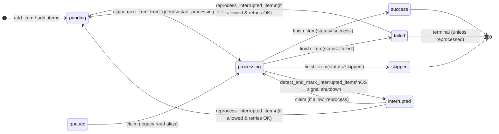
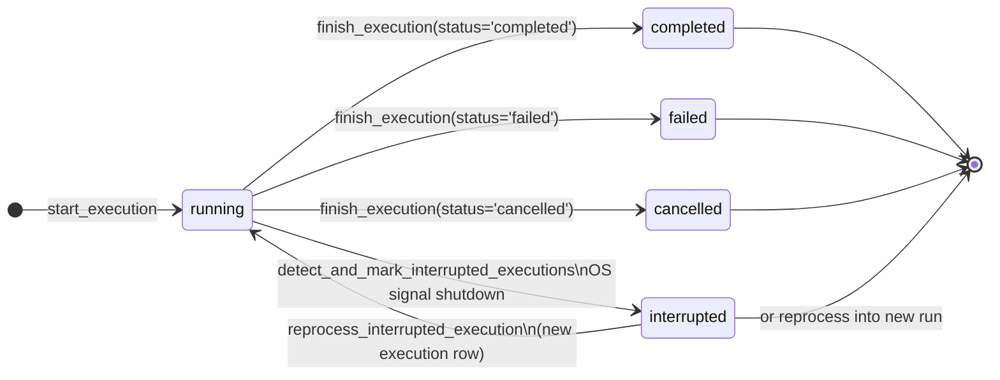
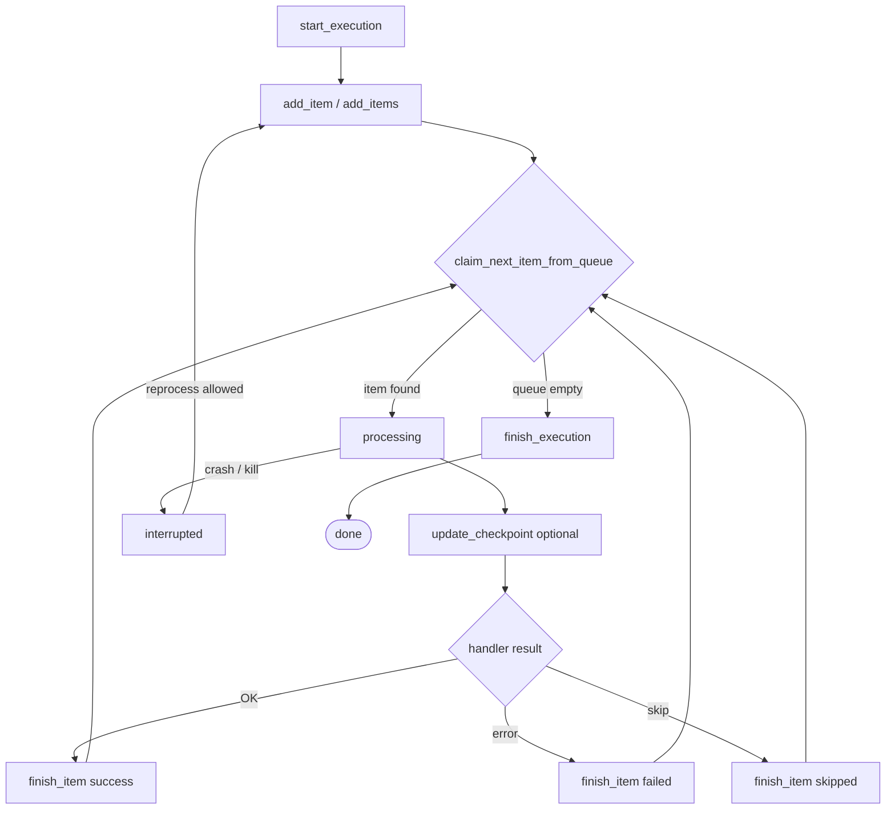

# Overview

**RPA Suite** é uma biblioteca voltada para o uso em desenvolvimento de bots e RPAs profissionais.
Com ferramentas que **aceleram o desenvolvimento**, reduzindo o tempo necessario para desenvolver pequenos blocos que são responsaveis por tarefas muito comuns e repetitivas no mundo dos RPAs.

## Components

Os componentes são divididos por categoria de atuação ou de funcionalidade. Estão organizados na subpasta *core*.
Você pode fazer a importação de pelo menos duas formas diferentes.

<hr>
<br>

## Quick Start

### Instalation

Primeiramente certifique-se de ter instalado o Python, este passo é muito importante 😄

Segundo passo também é essencial que seria instalar a nossa lib:

```pip
python -m pip install rpa-suite
```

Ou:

```pip
pip install rpa-suite
```

Ou ainda, desta forma também:

```pip
pip install rpa_suite
```

> **⚠️ Lembrete:**
> para o uso em ambientes virtuais lembre-se de ativar o seu ambiente no terminal onde pretende fazer instalações.

> **⚠️ Importante:**
> Atualmente não estamos fazendo otimizações para versão na plataforma Linux, recomendamos o uso apenas na plataforma Windows (8.1 ou superior).

<hr>
<br>

## Usage Guide

### Form 1: Using variable rpa _(recommended)_

A variavel **rpa** esta disponivel já na importação do modulo com a maioria dos objetos instanciados.

Você pode acessar diretamente os metodos dos submodulos com esta variavel.

```python
# Importando a suite instanciada com todas funcionalidades
from rpa_suite import rpa

# Usando como exemplo o modulo de log, fazendo sua configuração
rpa.log.config_logger()

# Gerando um log no arquivo
rpa.log.log_start_run_debug(f'teste')


# Este código deve gerar uma pasta 'log' no diretório raiz onde esta sendo executado, com um arquigo 'log.log' e escrever um log inicial no arquivo e no terminal
>>> DD.MM.YY.HH:MM DEBUG    teste
```

### Form 2: Using object Suite

Também é possivel instanciar a Suite de ferramentas criando seu proprio objeto.

Importe a classe ``Suite``, instancie  e acesse da mesma forma todos recursos.

```python
# Importando objeto Suite para criar sua propria instancia
from rpa_suite.suite import Suite

# Instancie a Suite com nome que desejar
rpa = Suite()

# Usando como exemplo o modulo de log, fazendo sua configuração
rpa.log.config_logger()


# Gerando um log no arquivo
rpa.log.log_start_run_debug(f'teste')


# Este código deve gerar uma pasta 'log' no diretório raiz onde esta sendo executado, com um arquigo 'log.log' e escrever um log inicial no arquivo e no terminal
>>> DD.MM.YY.HH:MM DEBUG    teste
```

### Form 3: Using variable suite

Opcionalmente pode usar a variavel **suite** que possui as classes disponiveis.

```python
# Importando o objeto instanciado 'suite' também te dará acesso aos outros objetos 
from rpa_suite import suite

# Instanciando apenas um obojeto de Log
my_logger = suite.Log()

# Usando como exemplo o modulo de log, fazendo sua configuração
my_logger.config_logger()

# Gerando um log no arquivo
my_logger.log_start_run_debug(f'teste')

# Este código deve gerar uma pasta 'log' no diretório raiz onde esta sendo executado, com um arquigo 'log.log' e escrever um log inicial no arquivo e no terminal
>>> DD.MM.YY.HH:MM DEBUG    teste
```

### Form 4: Modular use

Para usar isoladamente apenas um Submodulo, acesse ``core`` e faça a importação do modulo desejado.

```python

# Importando diretamente a classe do modulo desejado
from rpa_suite.core import Log

# Instancie o Objeto
my_logger = Log()

# Usando como exemplo o modulo de log, fazendo sua configuração
my_logger.config_logger()

# Escrevendo no arquivo de log
my_logger.log_start_run_debug(f'teste')

# Este código deve gerar uma pasta 'log' no diretório raiz onde esta sendo executado, com um arquigo 'log.log' e escrever um log inicial no arquivo e no terminal
>>> DD.MM.YY.HH:MM DEBUG    teste
```

<hr>
<br>

# Modules Guide

## Print

**Print** é um submodulo do nosso conjunto.
Este tem um caracteristica difernente dos demais.

Sua implementação foi feita tanto no Objeto raiz como também no seu modulo dedicado, acesse seus métodos tanto pela variavel ``rpa`` como também pela classe **Print**.

Abaixo todos métodos e argumentos disponiveis de **Print**:

Metodos:

- ``success_print``
- ``alert_print``
- ``error_print``
- ``info_print``
- ``magenta_print``
- ``blue_print``
- ``print_call_fn``
- ``print_return_fn``

Argumentos:

- ``string_text``: ``str``
- ``color`` : ``Obj Colors``
- ``ending`` : ``str``

> Se desejar importar ou instanciar de outra forma veja o guia na parte de "Componentes" ou "Formas de Uso".
>
> Também é possivel fazer o import da seguinte forma, para usar o Objeto isolado:
>
> `from rpa_suite.core import Print`

<br>

Exemplo de uso das funções de ``Print``:

```python
# Importação do objeto instanciado de Suite
from rpa_suite import rpa

"""
Cores disponiveis
  black   
  blue  
  green   
  cyan  
  red   
  magenta 
  yellow  
  white   
  default 
  call_fn (variação de blue) 
  retur_fn (variação de magenta)
"""

# Como explicado anteriormente, já foi implementada diretamente todas funções do obj Print diretamente no modulo principal

rpa.success_print(f'It`s green here')
rpa.alert_print(f'It`s yellow message')
rpa.error_print(f'It`s red message')
rpa.info_print(f'It`s blue message')

rpa.magenta_print(f'What color? Magenta')
rpa.blue_print(f'Other blue')

# variações (estas tem apenas objetivo de serem cores distintas para quem quer ser mais direto e sem muitas cores)
rpa.print_call_fn(f'foo')
rpa.print_return_fn(f'foo2')
```

Abaixo variações do uso e possibilidade de mudar as cores a sua vontade:

> É possivel mudar a cor do seu print a sua vontade, importe o objeto de cores para isso.
>
> Defina também o "ending" assim como o print padrão do python.

<br>

Exemplo manipulando as cores e o ending:

```python
# Importação do objeto de Suite e Colors
from rpa_suite import rpa
from rpa_suite.core.print import Colors

# Passagem de argumentos, mudança de comportamento e cores
rpa.success_print(f'It`s red now!', color=Colors.red)
rpa.alert_print(f"This don't breakline on ending", ending=' ')
rpa.error_print(f'This message display on same line to alert.')

# Exemplo com todos argumentos explicitos
rpa.info_print(string_text=f'All arguments explicts',
               color=Colors.blue,
               ending="\n\n"
              )
```

<br>

## Date

**Date** é um Objeto simples que tem por finalidade apenas acelerar a conversão de Data e Hora.
Em muitos casos precisamos capturar Datas o que já é bem facil, no entando queremos pular a parte chata de ter que ficar formatando.

Sua principal funcionalidade é devolver uma tupla ja com **Dia**, **Mes** e **Ano** formatada como **string** usando 2 digitos e o ano em 4 digitos. O mesmo valoe para **Horas**, **Minutos** e **Segundos** (este ultimo apenas com 2 digitos).

Abaixo todos métodos e argumentos disponiveis de **Date**:

Metodos:

- ``get_dmy``
- ``get_hms``

Argumentos:

- ``Na verão atual não há argumentos``

Retorno:

- ``get_dmy``  -> ``Tuple(str)``: ``'dd', 'mm', 'YYYY'``
- ``get_hms``  -> ``Tuple(str)``: ``'hour', 'min', 'sec'``
- Obs.: Apenas "Year" tem 4 digitos, os demais dados são sempre em 2 digitos **string**.

> Se desejar importar ou instanciar de outra forma veja o guia na parte de "Componentes" ou "Formas de Uso".
>
> Também é possivel fazer o import da seguinte forma, para usar o Objeto isolado:
>
> `from rpa_suite.core import Date`

<br>

Exemplo de uso dos Metodos de ``Date``:

```python
# Importando a suite instanciada com todas funcionalidades
from rpa_suite import rpa

# Usando a variavel date (objeto Date já instanciado) acessamos seu método que captura dia, mes e ano atual do seu sistema.
dd, mm, yyyy = rpa.date.get_dmy()

# Usando a variavel date (objeto Date já instanciado) acessamos seu método que captura hora, segundos e minutos atual do seu sistema.
hour, minute, sec = rpa.date.get_hms()

# exibindo o retorno obtido para data
rpa.info_print(f'date: {dd}/{mm}/{yyyy}')

# exibindo o retorno obtido para horario
rpa.info_print(f'hour: {hour}:{minute}:{sec}')

>>> date: 18/04/2025
>>> hour: 04:44:29
```

<br>

## Clock

**Clock** é um Objeto dedicado a fazer controle de execução.
Por vezes precisamos que um bloco de código ou uma função inteira aguarde, execute e espere, ou até mesmo podemos usar como Schedule para um robo inteiro.

Abaixo todos métodos e argumentos disponiveis de **Clock**:

Metodo ``exec_at_hour``:

- Função temporizada, executa a função no horário especificado.

  por ``default`` executa no momento da chamada em tempo de execução, opcionalmente pode escolher o horário para execução, sendo uma ``string`` contendo horas e minutos com dois digitos como demonstrado a seguir: ``'hh:mm'``.
- Argumentos:

  - ``hour_to_exec`` : ``str`` - Horario no formato `'hh:mm'`.
  - ``fn_to_exec``: ``Callable`` - Função que deseja executar.
  - ``*args``: Argumentos posicionais da função.
  - ``**kwargs``: Argumentos nomeados da função.

<br>

Metodo ``wait_for_exec``:

- Função temporizada, aguarda uma quantidade de tempo em **segundos** para executa a função em seguida.

  Por ``default`` executa no momento da chamada em tempo de execução.
- Argumentos:

  - ``wait_time`` : ``int`` - Tempo em segundos para aguardar.
  - ``fn_to_exec`` : ``Callable`` - Função que deseja executar.
  - ``*args``: Argumentos posicionais da sua função.
  - ``**kwargs``: Argumentos nomeados da sua função.

<br>

Metodo ``exec_and_wait``:

- Função temporizada, executa a função do argumento e em seguinda aguarda o tempo desejado em segundos.

  Por ``default`` executa no momento da chamada em tempo de execução.
- Argumentos:

  - ``wait_time``:``int`` - Tempo em segundos para aguardar após execução.
  - ``fn_to_exec``: ``Callable`` - Função que deseja executar.
  - ``*args``: Argumentos posicionais da sua função.
  - ``**kwargs``: Argumentos nomeados da sua função.

<br>

> Se desejar importar ou instanciar de outra forma veja o guia na parte de "Componentes" ou "Formas de Uso".
>
> Também é possivel fazer o import da seguinte forma, para usar o Objeto isolado:
>
> `from rpa_suite.core import Clock`

<br>

Exemplo de uso ``exec_at_hour``:

```python
# Importando a suite instanciada com todas funcionalidades
from rpa_suite import rpa


# Aqui sua função que deseja executar
def sum(a, b):
  # realiza operações quais forem ...
  print(a*b)
  return a * b


# Este passo não é necessario, apenas par facilitar visualmente
a = 3
b = 9

# Executa a função no horario definido
rpa.clock.exec_at_hour('12:52', sum, a, b)

# result: A função soma deve ser executada no horario 12:52 do sistema onde esta rodando  o código.
>>> 27
>>> sum: Successfully executed!
```

<br>

Exemplo de uso ``wait_for_exec``:

```python
# Importando a suite instanciada com todas funcionalidades
from rpa_suite import rpa


# Aqui sua função que deseja executar
def sum(a, b):
  # realiza operações quais forem ...
  print(a*b)
  return a * b


# Este passo não é necessario, apenas par facilitar visualmente
a = 3
b = 9

# Executa a função após 10 segundos
rpa.clock.wait_for_exec(10, sum, a, b)

# result: A função soma deve ser executada após o tempo definido.
>>> 27
>>> Function: wait_for_exec executed the function: sum.
```

<br>

Exemplo de uso ``exec_and_wait``:

```python
# Importando a suite instanciada com todas funcionalidades
from rpa_suite import rpa


# Aqui sua função que deseja executar
def sum(a, b):
  # realiza operações quais forem ...
  print(a*b)
  return a * b


# Este passo não é necessario, apenas par facilitar visualmente
a = 3
b = 9
time_await = 10

# Executa a função, então aguarda 10 segundos para seguir com o proximo código
rpa.clock.exec_and_wait(time_await, sum, a, b)

# Esta função abaixo, sera executada sómente 10 segundos após a execução da função acima
rpa.success_print(f'Run after: {time_await}')

# result: A função soma deve ser executada após o tempo definido.
>>> 27
>>> Function: wait_for_exec executed the function: sum.
>>> Run after: 10
```

<br>

## Directory

**Directory** é um Objeto dedicado a manipulação de diretórios, criação de pastas, exclusão de pastas, e exclusão de conteudos dentro de pastas.

Abaixo todos métodos e argumentos disponiveis de **Directory**:

Metodo ``create_temp_dir``:

- Função responsavel por criar diretório temporário, pode também criar diretório com nome desejado e salvar o path relativo para uso posterior.

  Por ``default`` o nome do diretório é "temp" e o caminho é onde esta sendo executada a função.
- Argumentos:

  - ``path_to_create``: ``str`` - Caminho para criar o diretório.
  - ``name_temp_dir``: ``str`` - Nome desejado para o diretório.
  - ``display_message``: ``bool`` - Opção se deseja que exiba mensagens no terminal.

<br>

Metodo ``delete_temp_dir``:

- Função responsavel por deletar diretório temporário, pode também deletar diretório com nome desejado e opcionalmente excluir diretórios que estejam populados com conteudo.

  Por ``default`` o nome do diretório é "temp" e o caminho é onde esta sendo executada a função.
- Argumentos:

  - ``path_to_delete``: ``str`` - Caminho para deletar o diretório.
  - ``name_temp_dir``: ``str`` - Nome do diretório a deletar.
  - ``delete_files``: ``bool`` - Opção se deseja excluir diretório mesmo populado.
  - ``display_message``: ``bool`` - Opção se deseja que exiba mensagens no terminal.

<br>

> Se desejar importar ou instanciar de outra forma veja o guia na parte de "Componentes" ou "Formas de Uso".
>
> Também é possivel fazer o import da seguinte forma, para usar o Objeto isolado:
>
> `from rpa_suite.core import Directory`

<br>

Exemplo de uso ``create_temp_dir``:

```python
# Importando a suite instanciada com todas funcionalidades
from rpa_suite import rpa

# Acessando a instancia de 'dir' directory acessamos seu método para criar uma pasta temporaria
result = rpa.directory.create_temp_dir()

# Exibindo o dict de resultado obtido com o retorno da função
# A função retorna um dict com o status de sucesso e o path da pasta criada
rpa.success_print(result)

>>> A função deve criar uma pasta chamada 'temp' no diretório onde esta sendo executado este código.
>>> result: {'success': True, 'path_created': 'C:\\User\\path\\to\\your_project\\temp'}


# Usando argumentos
result_example2 = rpa.directory.create_temp_dir(path_to_create=r'.\docs', name_temp_dir='mydir')

# Exibindo o dict de resultado obtido com o retorno da função
# A função retorna um dict com o status de sucesso e o path da pasta criada
rpa.success_print(result_example2)

>>> A função deve criar uma pasta chamada 'docs' e interna a esta outra chamada 'mydir' considerando a raiz atual como ponto de partida.
>>> result_example2: {'success': True, 'path_created': '.\\docs\\mydir'}
```

<br>

Exemplo de uso ``delete_temp_dir``:

```python
# Importando a suite instanciada com todas funcionalidades
from rpa_suite import rpa

# Acessando a instancia de 'dir' directory acessamos seu método para criar uma pasta temporaria
result = rpa.directory.delete_temp_dir()

# Exibindo o dict de resultado obtido com o retorno da função
# A função retorna um dict com o status de sucesso e o path da pasta deletada
rpa.success_print(result)

>>> A função deve deleta uma pasta chamada 'temp' no diretório onde esta sendo executado este código.
>>> result: {'success': True, 'path_deleted': 'C:\\Intel\\PERSONAL\\_rpa_suite\\test_suite\\temp'}

# Usando argumentos
result_example2 = rpa.directory.delete_temp_dir(
    path_to_delete=r'.\docs', 
    name_temp_dir='mydir',
    delete_files=True)

# Exibindo o dict de resultado obtido com o retorno da função
# A função retorna um dict com o status de sucesso e o path da pasta deletada
rpa.success_print(result_example2)

>>> A função deve deletar uma pasta chamada 'mydir' interna em relação a pasta 'docs' considerando a raiz atual como ponto de partida.
>>> result_example2: {'success': True, 'path_deleted': '.\\docs\\mydir'}
```

## Email

**Email** é um Objeto dedicado a emails, envio e manipulação, no entanto temos apenas formato SMPT implementado, *em breve vamos disponibilizar outros métodos*.

Abaixo todos métodos e argumentos disponiveis de **Email**:

Metodo ``send_smtp``:

- Função responsavel por fazer envio de emails usando SMTP, com possibilidade de incluir anexos, a finalidade é reduzir a quantidade de código usado para tal, pois emails precisam de muitos detalhes declarados.

  Por ``default`` o servidor, a porta e a autenticação são definidos seguindo o padrão da hostinger, e o body do email já é definido para aceitar conteudo em _HTML_.
- Argumentos:

  - ``email_user`` : ``str`` - Email do remetente.
  - ``email_password`` : ``str`` - Senha do remetente.
  - ``email_to`` : ``str`` - Email do destinatario.
  - ``subject_title`` : ``str`` - Titulo do email.
  - ``body_message`` : ``str`` - Mensagem do Email, **aceita HTML**.
  - ``attachments`` : ``list[str]`` - Lista com path de anexos.
  - ``smtp_server`` : ``str`` - Servidor a utilizar.
  - ``smtp_port`` : ``int`` - Porta a utilizar.
  - ``auth_tls`` : ``bool`` - Tipo de autenticação, se **False usa SSL**.
  - ``display_message``: ``bool`` - Opção se deseja que exiba mensagens no terminal.

<br>

> Se desejar importar ou instanciar de outra forma veja o guia na parte de "Componentes" ou "Formas de Uso".
>
> Também é possivel fazer o import da seguinte forma, para usar o Objeto isolado:
>
> `from rpa_suite.core import Email`

<br>

Exemplo de uso ``send_smtp``:

```python
# Importando a suite instanciada com todas funcionalidades
from rpa_suite import rpa

# Acessando a instancia de 'Email' acessamos seu método para enviar email por SMTP
rpa.email.send_smtp(email_user='your@email.com',
                    email_password='your_password',
                    email_to='destiny@email.com',
                    subject_title='Test Title',
                    body_message='Test body message.',
                    attachments=['C:/Users/rpa_suite/Pictures/logo_rpa_suite.jpg'],
                    smtp_server='smtp.gmail.com',
                    smtp_port=587,
                    auth_tls=False,
                    display_message=True)

```

## File

**File** é um Objeto dedicado a operações basicas com arquivos, como contagem, criação e exclusão. Porem com finalidades mais definidas para acelerar o desenvolvimento e facilitar tarefas simples.

Abaixo todos métodos e argumentos disponiveis de **File**:

Metodo ``flag_create``:

- Função responsavel por criar um arquivo que serve como flag para indicar a execução do script, automação ou aplicação.

  Por ``default`` o nome do arquivo é ``running.flag`` porem pode ser mudando via argumento, e o diretório onde é criado é a raiz onde esta sendo executado, podendo este também ser alterado via parametros.
- Argumentos:

  - ``name_file`` : ``str`` - Nome do arquivo desejado incluindo a extensão.
  - ``path_to_create`` : ``str`` - Caminho do diretório onde deve ser criado o arquivo.
  - ``display_message``: ``bool`` - Opção se deseja que exiba mensagens no terminal.

<br>

Metodo ``flag_delete``:

- Função responsavel por deletar um arquivo que serve como flag para indicar a execução do script, automação ou aplicação.

  Por ``default`` o nome do arquivo é ``running.flag`` porem pode ser mudando via argumento, e o diretório onde ira excluir é a raiz onde esta sendo executado, podendo este também ser alterado via parametros.
- Argumentos:

  - ``name_file`` : ``str`` - Nome do arquivo desejado incluindo a extensão.
  - ``path_to_delete`` : ``str`` - Caminho do diretório onde deve ser excluido o arquivo.
  - ``display_message``: ``bool`` - Opção se deseja que exiba mensagens no terminal.

<br>

Metodo ``count_files``:

- Função responsavel por contar arquivos em um diretório, possivel especificar o diretório onde deseja contar e a extensão desejada, principal caracteristica é que ja percorreo as demais pastas internas se houver.

  Por ``default`` o caminho onde busca pelo diretório é a raiz onde esta sendo executado ``'.'`` usando assim por padrão o caminho relativo, também é definido que busque por todas extensões. A contagem é retornada em um ``dict``.
- Argumentos:

  - ``dir_to_count`` : ``str`` - Caminho para o diretório desejado para fazer a contagem
  - ``type_extension`` : ``str`` - Extensão que deseja realizar a contagem.
  - ``display_message``: ``bool`` - Opção se deseja que exiba mensagens no terminal.

<br>

Metodo ``screen_shot``:

- Função responsavel por registrar uma imagem do monitor utilizado, podendo passar diversos argumentos para parametrizar da melhor maneira que deseja, principal caracteristica é que cria tanto a pasta como o arquivo de maneira automatica se nenhum argumento for passado, registrando cada imagem com uso de data e horario para poder registrar multiplas imagens se necessario.

  Por ``default`` o caminho onde cria o diretório é a raiz onde esta sendo executado e o nome do diretório é ``screenshots``, e o nome do arquivo é ``'screenshot_dd_mm_aaaa-hh-mm-ss.png'``.
- Argumentos:

  - ``file_name`` : ``str`` - Nome do arquivo, ``default`` sendo ``'screenshot'``.
  - ``path_dir`` : ``str`` - Caminho para criar o diretório.
  - ``save_with_date`` : ``bool`` - Se deseja a data no nome do arquivo, ``default`` sendo ``'True'``.
  - ``delay`` : ``int`` - Atraso para geração de imagem, ``default`` sendo ``1``.
  - ``use_default_path_and_name`` : ``bool`` - Se deseja usar nome e caminho padrão, por padrão ``True``.
  - ``name_ss_dir`` : ``str`` - Nome desejado para o diretório caso não escolha manter o padrão.
  - ``display_message``: ``bool`` - Opção se deseja que exiba mensagens no terminal.

<br>

> Se desejar importar ou instanciar de outra forma veja o guia na parte de "Componentes" ou "Formas de Uso".
>
> Também é possivel fazer o import da seguinte forma, para usar o Objeto isolado:
>
> `from rpa_suite.core import File`

<br>

Exemplo de uso ``flag_create``:

```python
# Importando a suite instanciada com todas funcionalidades
from rpa_suite import rpa

# Acessando a instancia de 'File' acessamos seu método para criar um arquivo de flag no diretório onde esta sendo executado este arquivo
rpa.file.flag_create(name_file='running_my_bot.flag',
                    display_message=True)


>>> Flag file created.
```

Exemplo de uso ``flag_delete``:

```python
# Importando a suite instanciada com todas funcionalidades
from rpa_suite import rpa

# Acessando a instancia de 'File' acessamos seu método para deletar um arquivo de flag no diretório onde esta sendo executado este arquivo
rpa.file.flag_delete(name_file='running_my_bot.flag',
                    display_message=True)


>>> Flag file deleted.
```

Exemplo de uso ``count_files``:

```python
# Importando a suite instanciada com todas funcionalidades
from rpa_suite import rpa

# Considere que existe a pasta 'docs' no mesmo nivel deste arquivo, com 3 arquivos dentro dela

# Acessando a instancia de 'File' acessamos seu método para contar arquivos, caminho relativo passado em forma de lista caso queira contar varios diretórios
result = rpa.file.count_files(['docs'], display_message=True)
rpa.success_print(result)


>>> Function: count_files counted 3 files.
>>> {'success': True, 'qt': 3}
```

Exemplo de uso ``screen_shot``:

```python
# Importando a suite instanciada com todas funcionalidades
from rpa_suite import rpa

# !Important: Esta funcionalidade precisa das libs: pyautogui e pillow! (rpa_suite já as instala, porem verifique em caso de problemas)

# Acessando a instancia de 'File' acessamos seu método para realizar screenshots com apenas uma linha.
rpa.file.screen_shot()

>>> Diretório:'C:\Users\You\your_project\here\screenshots' foi criado com sucesso.
```

<br>

## Log

**Log** é um Objeto dedicado a criação, registro e acompanhamento de logs. Sua estrutura é bastante simples conta com apenas 2 tipos de método, o primeiro para fazer a configuração, criando um diretório e arquivo para registro.

O segundo tipo gerando os logs desejados.

Principais destaques:

- Facilidade de realizar tudo com apenas 2 linhas de código, e quando o registro já existe não é substituido, facilitando a manutenção e continuidade de logs caso deseje usar como histórico.
- Conta com um método considerado "start" para registrar uma linha em branco no arquivo facilitando a divisão do arquivo por execuções.
- Registro com dados que facilitam a navegação por estruturas grandes de código apontando a ultima subpasta e o arquivo onde foi disparado o log.

Abaixo todos métodos e argumentos disponiveis de **Log**:

Metodo ``config_logger``:

- Função por configurar um logger e apontar para o caminho do arquivo desejado, gerando assim os logs no arquivo e também registrando as mensagems no console, todas mensagens já são personalizadas para diferencia-las.

  Também conta com um filtro de palavras para excluir dados sensiveis se necessario. (Neste módulo estamos realizando ajustes constantemente para oferecer uma esperiencia mais completa)

  Por ``default`` o caminho onde cria o diretório e arquivo é a raiz onde esta sendo executado ``'.'`` usando assim por padrão o caminho relativo, esta mesmo caminho é utilizado pelas funções de log para registra as mensagens no arquivo e também no console.

> **⚠️ Importante:**
> Garanta que seja executado o método config_logger antes de chamar os métodos de log para garantir que não haverá erros.

- Argumentos:

  - ``path_dir`` : ``str`` - Caminho para criar o diretório, por ``default`` o caminho do arquivo em execução.
  - ``name_log_dir`` : ``str`` - Nome do diretório de logs, por ``default`` chama-se ``'Logs'``.
  - ``name_file_log`` : ``str`` - Nome do arquivo de log, por ``default`` chama-se ``'log'`` com extensão fixa: ``.log``
  - ``filter_words`` : ``list[str]`` - Lista de palavras que deseja filtrar para não aparecer no registro, use para dados sensiveis.

<br>

Metodos ``log_start_run_debug``, ``log_debug``, ``log_info``, ``log_warning``, ``log_error``, ``log_critical``:

- Métodos responsaveis por gera um registro de log no arquivo e no console. Em especial o prieiro método ``log_start_run_debug`` adiciona uma linha vazia antes de registrar o conteudo, facilitando dividir o arquivo para encontrar pontos de inicio de execução.

Todos os métodos são pré personalizados por seus leveis e também com cores para facilitar que sejam diferenciados entre si.

> **⚠️ Importante:**
> Garanta que seja executado o método config_logger antes de chamar os métodos de log para garantir que não haverá erros.

- Argumentos:

  - ``msg`` : ``str`` - Mensagem desejada no registro de log.

<br>

> Se desejar importar ou instanciar de outra forma veja o guia na parte de "Componentes" ou "Formas de Uso".
>
> Também é possivel fazer o import da seguinte forma, para usar o Objeto isolado:
>
> `from rpa_suite.core import Log`

<br>

Exemplo de uso ``config_logger``:

```python
# Importando a suite instanciada com todas funcionalidades
from rpa_suite import rpa

# Acessando a instancia de 'Log' acessamos seu método que configura o logger, cria a pasta e também o arquivo de log
rpa.log.config_logger()

# Este método deve criar uma pasta no local atual da execução chamada Logs com arquivo 'log.log' disponibilizando assim que use as funções de log para registrar neste arquivo.

# !IMPORTANT: garanta que instancie primeiramente no seu código config_logger para usar livremente as funções de log em qualquer etapa do seu projeto e qualquer arquivo, se os métodos de log forem chamados sem a configuração primeiro, apresentarão erro.

>>> Diretório:'C:\Users\You\your_project\here\Logs' foi criado com sucesso.
```

<br>

Exemplo de uso ``log_start_run_debug``, ``log_info``, ``log_warning``, ``log_error`` ,``log_critical``, ``log_debug``:

```python
# Importando a suite instanciada com todas funcionalidades
from rpa_suite import rpa


# !IMPORTANT: Garanta que ja tenha sido executado o método config_logger deste módulo anteriormente no seu projeto para poder capturar e apontar para o arquivo correto e gerar os logs.


# Métodos de log disponíveis para uso, registra tanto no arquivo como também no console ja personalizado, além de gerar um espaço no arquivo para determinar o inicio da execução com log de start
rpa.log.log_start_run_debug(f'Iniciando execução do script {__file__}')

rpa.log.log_info(f'Executando tarefa exemplo 1')

rpa.log.log_warning(f'Executando tarefa exemplo 2 com warning')

rpa.log.log_error(f'Executando tarefa exemplo 3 com erro')

rpa.log.log_critical(f'Executando tarefa exemplo 4 com erro crítico')

rpa.log.log_debug(f'Executando tarefa exemplo 5 com debug')

>>> 21.04.25.00:33 DEBUG    Iniciando execução do script c:\You\your_project\here\this_file.py
>>> 21.04.25.00:33 INFO     Executando tarefa exemplo 1
>>> 21.04.25.00:33 WARNING  Executando tarefa exemplo 2 com warning
>>> 21.04.25.00:33 ERROR    Executando tarefa exemplo 3 com erro
>>> 21.04.25.00:33 CRITICAL Executando tarefa exemplo 4 com erro crítico
>>> 21.04.25.00:33 DEBUG    Executando tarefa exemplo 5 com debug
```

<br>

## Regex

**Regex** é um Objeto dedicado para uso de regex, contamos com um método convencional para buscar uma substring em uma string. Posteriormente vamos adicionar funcionalidades para tornar este módulo mais interessante e utilizavel em mais casos.

Principais destaques:

- Facilidade de realizar busca de uma string dentro de outra string de maneira mais rapida que o convencional com uso de re.
- Tem uso mais amplo que o padrão do python com ``__contains__`` pois já devolve um valor boleano com a possibilidade de mudar o estado de busca com uso de case sensitive como False.

Abaixo todos métodos e argumentos disponiveis de **Regex**:

Método ``check_pattern_in_text``:

- Função responsavel por realizar a busca de uma string em outra string, capacidade de ser ou não case sensitive sem uso de blocos ``if`` e sem a necessidade de fazer Upper ou Lower no conteudo original.
- Argumentos:

  - ``origin_text`` : ``str`` - Conteudo de texto para a busca, deve ser uma string.
  - ``pattern_to_search`` : ``str`` - Padrão desejado para a busca.
  - ``case_sensitive`` : ``bool`` - Opção que indica se deve ser uma busca case sensitive.
  - ``display_message``: ``bool`` - Opção se deseja que exiba mensagens no terminal.

<br>

> Se desejar importar ou instanciar de outra forma veja o guia na parte de "Componentes" ou "Formas de Uso".
>
> Também é possivel fazer o import da seguinte forma, para usar o Objeto isolado:
>
> `from rpa_suite.core import Regex`

<br>

Exemplo de uso ``check_pattern_in_text``:

```python
# Importando a suite instanciada com todas funcionalidades
from rpa_suite import rpa

# Acessando a instancia de 'Regex' acessamos seu método que busca padrões em um texto, com opção de ser case sensitive e exibir mensagem retornando um valor booleano
result: bool = rpa.regex.check_pattern_in_text(origin_text= 'This is a simple text with a pattern to search: Hello, World!',
                                pattern_to_search= 'hello, world',
                                case_sensitive= False,
                                display_message= True)

if result:
    rpa.success_print('found!')


>>> Pattern found successfully!
>>> found!
```

<br>

## Validate

**Validate** é um Objeto dedicado para validação de dados, podendo ser palavras, strings e emails.

Principais destaques:

- Método word procura por palavras porem já faz a validação de espaços e pode separar um texto inteiro por lista de palavras para evitar falsos positivos.
- Método emails pode validar listas de emails o que facilita filtrar apenas emails validos para o envio com apenas uma chamada, retornando um dicionario com completo com todas informações como quantidade, e listas separadas de emails validos e invalidos.

Abaixo todos métodos e argumentos disponiveis de **Validate**:

Método ``word``:

- Função responsavel por realizar a busca de uma string ou palavra em uma string, com possibilidade de ser case sensitive e mudar a forma de validação da busca com _search_by_.

  Por ``default`` o tipo de busca é ``'string'`` podendo ser alterado para ``'word'``.
- Argumentos:

  - ``origin_text`` : ``str`` - Conteudo de texto para a busca, deve ser uma string.
  - ``searched_word`` : ``str`` - Padrão desejado para a busca.
  - ``case_sensitivy`` : ``bool`` - Opção que indica se deve ser uma busca case sensitive.
  - ``search_by`` : ``str`` - Opção que indica a forma de busca, pode ser ``string`` ou ``word``, a busca por _word_ divide a string original possibilitando encontrar apenas ocorrencias validas.
  - ``display_message``: ``bool`` - Opção se deseja que exiba mensagens no terminal.

<br>

> Se desejar importar ou instanciar de outra forma veja o guia na parte de "Componentes" ou "Formas de Uso".
>
> Também é possivel fazer o import da seguinte forma, para usar o Objeto isolado:
>
> `from rpa_suite.core import Validate`

<br>

Exemplo de uso ``word``:

```python
# Importando a suite instanciada com todas funcionalidades
from rpa_suite import rpa

# Acessando a instancia de 'Validate' acessamos seu método que busca strings com foco em palavras. Implementaremos um retorno com numero de ocorrencias e as posições de inicio e fim de cada ocorrencia.
result: dict = rpa.validate.word(origin_text='Texto de origem', searched_word='Origem', case_sensitivy=True, search_by='string', display_message=True)

rpa.success_print(result)

>>> Function: word found no occurrences of "Origem" during the search.
>>> {'is_found': False, 'number_occurrences': 0, 'positions': []}
```

<br>

Método ``emails``:

- Função responsavel por realizar validação de emails, que deve ser passado como uma lista de strings, sua implementação utiliza a biblioteca __mail_validator__.
- Argumentos:

  - ``email_list`` : ``list[str]`` - Lista de emails que deseja validar.
  - ``display_message``: ``bool`` - Opção se deseja que exiba mensagens no terminal.
- Retorno:

  - ``dict``: Dicionario que indica os resultados.
    - ``success``: ``bool`` - Chave que indica verdadeiro apenas se **todos** emails forem validos.
    - ``valid_emails``: ``list[str]`` - Lista de emails que são validos.
    - ``invalid_emails``: ``lis[str]`` - Lista de emails que não são validos.
    - ``qt_valids``: ``int`` - Numero de emails validos.
    - ``qt_invalids``: ``int`` - Numero de emails invalidos.
    - ``map_validation``: ``list[ Obj(ValidatedEmail) ]`` - Lista com os Objetos de _mail_validator_ que foi retornada.

<br>

> Se desejar importar ou instanciar de outra forma veja o guia na parte de "Componentes" ou "Formas de Uso".
>
> Também é possivel fazer o import da seguinte forma, para usar o Objeto isolado:
>
> `from rpa_suite.core import Validate`

<br>

Exemplo de uso ``emails``:

```python
# Importando a suite instanciada com todas funcionalidades
from rpa_suite import rpa

# Acessando a instancia de 'Validate' acessamos seu método 'emails' que valida uma lista conferindo se os emails são validos, utiliza a lib email_validator que pode ser um pouco lenta.
result: dict = rpa.validate.emails(email_list=['email@teste.com', 'test@test.br', 'invnalid_email@test'], display_message=True)

rpa.success_print(result)

>>> Function: emails executed.
>>> {'success': False, 'valid_emails': ['email@teste.com'], 'invalid_emails': ['test@test.br', 'invnalid_email@test'], 'qt_valids': 1, 'qt_invalids': 2, 'map_validation': [<ValidatedEmail email@teste.com>]}
```

<br>

## Asyn

**Asyn**: Um módulo projetado para simplificar a execução e gerenciamento de funções **assíncronas** em scripts de automação, utilizando o objeto **AsyncRunner**.

Principais características:

- Implementação simplificada de chamadas assíncronas, permitindo código mais limpo e direto
- Eliminação da necessidade de criar manualmente funções assíncronas para chamadas de métodos existentes
- Gerenciamento eficiente de tarefas assíncronas, otimizando o desenvolvimento de scripts e automações

Saiba mais sobre programação assíncrona em: *[Programação Assíncrona em Python](https://pythonacademy.com.br/blog/programacao-assincrona-no-python)*


> **⚠️ Importante:**
> *A execução de funções de forma assíncrona requer atenção cuidadosa para evitar problemas no código. É fundamental compreender as nuances entre Concorrência, Paralelismo e Assincronicidade.*
> *Sugestões de estudo aprofundado:*
> *[&gt; Introdução a concorrência e paralelismo](https://medium.com/nerd-for-tech/concurrency-and-parallelism-in-python-a-brief-introduction-9fd19b8c6433)*
> *[&gt; Aprenda sobre concorrência e paralelismo em Python](https://medium.com/nerd-for-tech/concurrency-and-parallelism-in-python-a-brief-introduction-9fd19b8c6433)*


Abaixo todos métodos e argumentos disponiveis de **Asyn**:

Método ``run``:

- Função responsavel por iniciar a execução de uma função em assincronicidade.
- Argumentos:

  - ``function`` : ``Callable[..., T]`` - O primeiro argumento deve ser sua função ou ``chamavel``.
  - ``*args``: ``Any`` - Argumentos posicionais da sua função ou chamavel.
  - ``*kwargs``: ``Any`` - Argumentos nomeados da sua função ou chamavel.

Método ``is_running``:

- Função responsavel por consultar a função que esta rodando de forma Assincrona para saber se já finalizou sua execução.
- Argumentos:

  - Nenhum argumento é passado pelo usuario para este método.
  - ``return`` : ``bool`` - Retorna ``False`` quando a função executada em assincronicidade já foi finalizada, ``True`` caso contrario.

Método ``get_result``:

- Função responsavel por recuperar o resultado (retorno) da função que foi executada de forma assincrona. Observe que get_result devolver um dicionario dentro de outro dicionario, o externo com as informações de assincronicidade que foi criada, e sua chave result com outro dicionario contendo o resultado (retorno) da execução da função.
- Argumentos:

  - ``timeout`` : ``Optional[float]`` - Opcionalmente pode ser passado o tempo limite para consultar e aguardar o resultado.
  - ``return`` : ``Dict[str, Any]`` - Retorna um dicionario contendo informações da assincronicidade, e uma de suas chaves devolve um dicionario com resultado da execução.

Método ``cancel``:

- Função responsavel por cancelar a execução em andamento da função que esta rodando de forma assincrona, este método valida primeiramente se realmente esta em execução para finalizar.
- Argumentos:

  - Nenhum argumento é passado pelo usuario para este método.

<br>

> Se desejar importar ou instanciar de outra forma veja o guia na parte de "Componentes" ou "Formas de Uso".
>
> Também é possivel fazer o import da seguinte forma, para usar o Objeto isolado:
>
> `from rpa_suite.core import AsyncRunner`

<br>

Exemplo de uso ``Asyn``:

```python
# Importando a suite instanciada, e também a classe para Tipar nosso objeto e facilitar a chamada dos métodos
from rpa_suite import rpa
from rpa_suite.core import AsyncRunner
from time import sleep


# Função que deve ser executada de forma assíncrona simulando uma tarefa demorada
def somar(a, b):
  
    print(f'Iniciando função de calculo')
    sleep(4)
    print(f'finalizando função de calculo')
    return a + b


# Função principal do seu script ou automação
def main():
  
    """Fluxo principal da automação"""
  

    print(f'Simulando 1 tarefa qualquer')
    sleep(3)

    # Opcionalmente você pode instanciar o objeto a partir da classe
    #runner: AsyncRunner = AsyncRunner()

    # Instanciando o objeto de execução assíncrona
    runner: AsyncRunner = rpa.Asyn()
  
    # Executando a função somar de forma assíncrona
    runner.run(somar, 10, 30)

    # Simulando outra tarefa enquanto a função somar ainda está em execução
    print(f'executando tarefa 2 enquanto somar ainda esta rodando em paralelo')
  
    # Aguardar 6 segundos para simular outra tarefa, caso esta seja rapida, é importante chamar sempre o método is_running() para verificar se a função em assincronissidade ainda está em execução.
    sleep(6)
  
    # Iniciamos a variável que irá armazenar o resultado da função somar
    result_soma = None
  
    # Verificamos se a função ainda está em execução, caso não esteja, chamamos o método get_result() para obter o resultado da função somar.
    if not runner.is_running():
        respons = runner.get_result(30)
        if respons['success']:
            result_soma = respons['result']
  
    print(f'Resultado obtido: {result_soma}')  


if __name__ == '__main__':
    main()

```

<br>

## Parallel

**Parallel**: Um módulo projetado para simplificar a execução e gerenciamento de funções em **paralelo** em scripts de automação,utilizando o objeto **ParallelRunner**.

Principais características:

- Implementação simplificada de execução paralela, eliminando a complexidade de gerenciamento manual de processos
- Métodos intuitivos para criação, execução e monitoramento de tarefas paralelas
- Código limpo e direto, reduzindo a verbosidade típica de implementações de paralelismo
- Abstração eficiente dos mecanismos de execução paralela, facilitando o desenvolvimento de aplicações concorrentes

Saiba mais sobre programação com paralelismo em: *[Paralelismo em Python (threads vs processos)](https://community.revelo.com.br/o-paralelismo-no-python-threads-vs-processos-parte-1/)*


> **⚠️ Importante:**
> *A execução de funções de forma assíncrona requer atenção cuidadosa para evitar problemas no código. É fundamental compreender as nuances entre Concorrência, Paralelismo e Assincronicidade.*
> *Sugestões de estudo aprofundado:*
> *[&gt; Introdução a concorrência e paralelismo](https://medium.com/nerd-for-tech/concurrency-and-parallelism-in-python-a-brief-introduction-9fd19b8c6433)*
> *[&gt; Aprenda sobre concorrência e paralelismo em Python](https://medium.com/nerd-for-tech/concurrency-and-parallelism-in-python-a-brief-introduction-9fd19b8c6433)*


Abaixo todos métodos e argumentos disponiveis de **ParallelRunner**:

Método ``run``:

- Função responsavel por iniciar a execução de uma função em **Paralelo**.
- Argumentos:

  - ``function`` : ``Callable[..., T]`` - O primeiro argumento deve ser sua função ou ``chamavel``.
  - ``*args``: ``Any`` - Argumentos posicionais da sua função ou chamavel.
  - ``*kwargs``: ``Any`` - Argumentos nomeados da sua função ou chamavel.

Método ``is_running``:

- Função responsavel por consultar a função que esta rodando de forma paralela para saber se já finalizou sua execução.
- Argumentos:

  - Nenhum argumento é passado pelo usuario para este método.
  - ``return`` : ``bool`` - Retorna ``False`` quando a função executada em paralelismo já foi finalizada, ``True`` caso contrario.

Método ``get_result``:

- Função responsavel por recuperar o resultado (retorno) da função que foi executada de forma paralela. Observe que get_result devolver um dicionario dentro de outro dicionario, o externo com as informações de paralelismo que foi criada, e sua chave result com outro dicionario contendo o resultado (retorno) da execução da função.
- Argumentos:

  - ``timeout`` : ``Optional[float]`` - Opcionalmente pode ser passado o tempo limite para consultar e aguardar o resultado.
  - ``return`` : ``Dict[str, Any]`` - Retorna um dicionario contendo informações da paralelismo, e uma de suas chaves devolve um dicionario com resultado da execução.

Método ``cancel``:

- Função responsavel por cancelar a execução em andamento da função que esta rodando de forma paralela, este método valida primeiramente se realmente esta em execução para finalizar.
- Argumentos:

  - Nenhum argumento é passado pelo usuario para este método.

<br>

> Se desejar importar ou instanciar de outra forma veja o guia na parte de "Componentes" ou "Formas de Uso".
>
> Também é possivel fazer o import da seguinte forma, para usar o Objeto isolado:
>
> `from rpa_suite.core import ParallelRunner`

<br>

Exemplo de uso ``Parallel``:

```python
# Importando a suite instanciada, e também a classe para demonstrar que pode ser feito de duas formas diferentes
from rpa_suite import rpa
from rpa_suite.core import ParallelRunner
import time

# Função que deve ser executada de forma assíncrona simulando uma tarefa demorada
def somar(a, b):
  
    print(f'Iniciando função soma')
    time.sleep(4)
    print(f'finalizando função soma')
    return a + b


# Função principal do seu script ou automação
def main():
  
    """Fluxo principal da automação"""
  
    print(f'realizando tarefa 1')
    time.sleep(3)
  
    # Opcionalmente você pode instanciar o objeto a partir da classe
    #runner: ParallelRunner = ParallelRunner()

    # Instanciando o runner para execução em paralelo a partir do objeto da suite
    runner: ParallelRunner = rpa.Parallel()
  
    # Chamada da função principal 'run' que ira disparar a sua função de forma paralela
    runner.run(somar, 10, 30)

    # apenas um exemplo para emular uma tarefa em sequencia
    print(f'executando tarefa 2 enquanto somar ainda esta rodando em paralelo')
  
    # Aguardar 6 segundos para simular outra tarefa, caso esta seja rapida, é importante chamar sempre o método is_running() para verificar se a função em paralelo ainda está em execução.
    time.sleep(6)
  
    # Iniciamos a variável que irá armazenar o resultado da função somar
    result_soma = None

    # Verificamos se a função ainda está em execução, caso não esteja, chamamos o método get_result() para obter o resultado da função somar.
    if not runner.is_running():
        respons = runner.get_result(30)
        if respons['success']:
            result_soma = respons['result']
  

    print(f'Resultado obtido: {result_soma}')  


if __name__ == '__main__':
    main()

```

<br>

# Database

**Database** is the RPA Suite module for execution tracking, item queues, structured logs, retention, reprocessing, and observability. It is designed for production RPA workflows: idempotent queues, checkpoints, retries, interruption handling, deduplication, and a built-in HTML dashboard.

You can import it in several ways:

```python
from rpa_suite.core import Database, DatabaseType, RetentionPolicy
from rpa_suite import rpa

db = rpa.database(...)          # via Suite (if exposed)
db = Database(...)              # direct import (recommended)
```

> **Optional dependency:** the HTML dashboard requires Flask (`pip install flask`).

---

## Table of contents

1. [Concepts](#concepts)
2. [Supported backends](#supported-backends)
3. [Constructor](#constructor)
4. [Quick start](#quick-start)
5. [Executions](#executions)
6. [Items & queue](#items--queue)
7. [Logs](#logs)
8. [Reprocessing](#reprocessing)
9. [Interruptions](#interruptions)
10. [Retention & storage](#retention--storage)
11. [Cleanup](#cleanup)
12. [Statistics & dashboard queries](#statistics--dashboard-queries)
13. [HTML dashboard](#html-dashboard)
14. [CLI](#cli)
15. [Best practices](#best-practices)

---

## Concepts

The module organizes RPA work into three layers:

| Layer | Purpose |
|-------|---------|
| **Executions** | One bot run (start → finish). Holds counters, metadata, and status. |
| **Items** | Individual work units inside a queue (orders, files, records, etc.). |
| **Logs** | Structured messages tied to an execution (and optionally forwarded to `Log`). |

### Item status model

The library **writes** these statuses:

```
pending → processing → success | failed | skipped | interrupted
```

- `queued` and `retrying` are **read aliases** for legacy rows; new inserts use `pending`.
- **`execution_id`** on an item = the execution that **created** it (`create_execution` in the dashboard).
- **`last_execution_id`** = the last execution that **touched** the item (claim, checkpoint, finish, reprocess, etc.).

#### Item status flow diagram



| Transition | Typical API |
|------------|-------------|
| → `pending` | `add_item`, `add_items`, `reprocess_interrupted_item` |
| → `processing` | `claim_next_item_from_queue`, `start_processing_item` |
| → `success` / `failed` / `skipped` | `finish_item` |
| → `interrupted` | `detect_and_mark_interrupted_items`, signal handler on shutdown |
| `interrupted` / `failed` → `pending` | `reprocess_interrupted_item`, `reprocess_items_from_execution` |

> **`retrying`** is not written by current code; treat it as a legacy read alias grouped with backlog filters.

#### Execution status flow diagram



| Transition | Typical API |
|------------|-------------|
| → `running` | `start_execution` |
| → `completed` / `failed` / `cancelled` | `finish_execution` |
| → `interrupted` | `detect_and_mark_interrupted_executions`, signal handler |
| `interrupted` → new `running` | `reprocess_interrupted_execution` (creates a child execution) |

#### End-to-end flow (execution + items)



### Active execution

After `start_execution()`, the instance stores `_current_execution_id`. Many methods accept an optional `execution_id`; when omitted, they use the active execution.

Always call `start_execution()` before adding items/logs, or pass `execution_id` explicitly.

---

## Supported backends

```python
from rpa_suite.core import DatabaseType

DatabaseType.SQLITE       # default — local file, best for dev/single-bot
DatabaseType.POSTGRESQL   # production server
DatabaseType.MYSQL        # production server
DatabaseType.SQLSERVER    # production server (requires pyodbc + ODBC driver)
```

### SQLite (default)

```python
db = Database(
    db_path="my_bot.db",
    db_dir="database",           # folder for the file; "default" = cwd
    executions_table="exec_bot",
    items_table="items_bot",
    logs_table="logs_bot",
)
```

### PostgreSQL / MySQL

```python
db = Database(
    db_type=DatabaseType.POSTGRESQL,
    host="localhost",
    port=5432,
    database="rpa_db",
    user="rpa_user",
    password="secret",
    use_pool=True,
    pool_size=5,
)
```

### SQL Server

```python
db = Database(
    db_type=DatabaseType.SQLSERVER,
    host="localhost",
    port=1433,
    database="rpa_db",
    user="sa",
    password="secret",
    driver="ODBC Driver 17 for SQL Server",  # optional
    trust_server_certificate=True,
    encrypt=True,
)
```

Requires: `pip install pyodbc` and a system ODBC driver.

---

## Constructor

```python
Database(
    db_type=DatabaseType.SQLITE,
    db_path="athena_executions.db",
    db_dir="default",
    host=None,
    port=None,
    database=None,
    user=None,
    password=None,
    driver=None,
    trust_server_certificate=True,
    encrypt=True,
    use_pool=True,
    pool_size=5,
    executions_table="athena_executions",
    items_table="athena_items",
    logs_table="athena_logs",
    allow_reprocess_interrupted_items=False,
    allow_reprocess_interrupted_executions=False,
    auto_detect_interruptions=True,
    mark_stale_on_init=False,
    auto_generate_execution_id=True,
    prevent_duplicate_items=False,
    unique_item_field="item_identifier",
    duplicate_item_behavior="skip",
    log_instance=None,
    verbose=False,
    retention_policy=None,
)
```

| Parameter | Type | Description |
|-----------|------|-------------|
| `db_type` | `DatabaseType` | Backend. Default: `SQLITE`. |
| `db_path` | `str` | SQLite file name (combined with `db_dir`). |
| `db_dir` | `str` | Directory for SQLite file. `"default"` = current working directory. Created if missing. |
| `host`, `port`, `database`, `user`, `password` | — | Server backends (PostgreSQL, MySQL, SQL Server). |
| `driver` | `str` | SQL Server ODBC driver name. |
| `trust_server_certificate`, `encrypt` | `bool` | SQL Server connection options. |
| `use_pool`, `pool_size` | — | Connection pooling (PostgreSQL/MySQL). |
| `executions_table`, `items_table`, `logs_table` | `str` | Custom table names (validated). |
| `allow_reprocess_interrupted_items` | `bool` | Allow reprocessing interrupted/failed items. |
| `allow_reprocess_interrupted_executions` | `bool` | Allow cloning an interrupted execution into a new run. |
| `auto_detect_interruptions` | `bool` | Register OS signal handlers to mark running work as interrupted on shutdown. |
| `mark_stale_on_init` | `bool` | On init, mark stale `running`/`processing` rows as interrupted. |
| `auto_generate_execution_id` | `bool` | Generate UUID for external `execution_id` when not provided. |
| `prevent_duplicate_items` | `bool` | Global deduplication across the items table. |
| `unique_item_field` | `str` | `"item_identifier"` or `"item_data.<key>"` (e.g. `"item_data.order_id"`). |
| `duplicate_item_behavior` | `str` | `"skip"` (return existing id) or `"error"`. |
| `log_instance` | `Log` | Optional `rpa_suite.core.Log` — DB logs also go to the file logger. |
| `verbose` | `bool` | Print init messages. |
| `retention_policy` | `RetentionPolicy` \| `dict` \| `None` | Automatic TTL/row-cap cleanup (see [Retention](#retention--storage)). |

### Context manager

```python
with Database(db_path="bot.db", auto_detect_interruptions=False) as db:
    exec_id = db.start_execution(automation_name="my-bot")
    ...
# connection closed automatically
```

---

## Quick start

Full minimal flow: execution → batch items → process → logs → finish → dashboard.

```python
from rpa_suite.core import Database

db = Database(
    db_path="rpa_test.db",
    db_dir="database",
    executions_table="execution_rpa_test",
    items_table="items_rpa_test",
    logs_table="logs_rpa_test",
    allow_reprocess_interrupted_items=True,
    prevent_duplicate_items=True,
    unique_item_field="item_data.valor",
    auto_detect_interruptions=False,
)

exec_id = db.start_execution(
    automation_name="order_processor",
    metadata={"version": "1.0.0", "env": "prod"},
)

db.add_log_info("Bot started", step_name="Init")

item_ids = db.add_items(
    items=[
        {
            "item_identifier": "ORD-001",
            "item_data": {"order_id": "ORD-001", "valor": 150.0},
            "priority": 10,
            "max_retries": 3,
        },
        {
            "item_identifier": "ORD-002",
            "item_data": {"order_id": "ORD-002", "valor": 80.0},
            "priority": 5,
        },
    ]
)

def handle_item(item: dict) -> str:
    # your business logic here
    return "Processed OK"

stats = db.process_queue(exec_id, handler=handle_item)
db.add_log_success(f"Queue done: {stats}", step_name="Finish")
db.finish_execution(exec_id)
db.close()
```

---

## Executions

### Methods

| Method | Description |
|--------|-------------|
| `start_execution(...)` | Start a new run; sets active execution. Returns internal `id` (int). |
| `finish_execution(execution_id, status='completed', error_message=None)` | Close a run. Status: `completed`, `failed`, `cancelled`. |
| `get_execution(execution_id)` | Fetch one execution row as dict. |
| `get_executions(status=None, automation_name=None, limit=None)` | List executions with optional filters. |
| `detect_and_mark_interrupted_executions(scope='current')` | Mark unfinished runs as `interrupted`. |
| `check_interrupted()` | Deprecated; returns whether current execution was interrupted. |

### `start_execution`

```python
exec_id = db.start_execution(
    automation_name="invoice_bot",
    execution_id="optional-external-uuid",   # optional; auto-generated if omitted
    metadata={"client": "ACME", "batch": 42},
)
```

**Returns:** `int` — internal primary key (`id`). Use this for items, logs, and finish calls.

### `finish_execution`

```python
db.finish_execution(exec_id, status="completed")
db.finish_execution(exec_id, status="failed", error_message="SMTP timeout")
```

Updates counters (`total_items`, `successful_items`, `failed_items`, `interrupted_items`) from items linked to that execution.

---

## Items & queue

### Adding items

#### `add_item`

```python
item_id = db.add_item(
    execution_id=None,              # uses active execution if omitted
    item_identifier="PED-1001",
    item_data={"pedido_id": "PED-1001", "valor": 250.0},
    processing_schema={"steps": ["validate", "submit"]},
    priority=10,                    # higher = claimed first
    max_retries=3,                  # 0 = unlimited
)
```

**Returns:** `int` — item id. With dedup enabled, may return an existing id (`duplicate_item_behavior="skip"`).

#### `add_items` (batch)

```python
ids = db.add_items(
    execution_id=exec_id,
    items=[
        {"item_identifier": "A", "item_data": {"id": "A"}, "priority": 1},
        {"item_identifier": "B", "item_data": {"id": "B"}, "priority": 2},
    ],
    default_priority=0,
    default_max_retries=0,
)
```

**Returns:** `list[int]` — created item ids.

### Deduplication

When `prevent_duplicate_items=True`:

```python
db = Database(
    prevent_duplicate_items=True,
    unique_item_field="item_identifier",       # or "item_data.order_id"
    duplicate_item_behavior="skip",            # or "error"
)
```

- **`skip`:** second insert with the same unique value returns the existing item id.
- **`error`:** raises `DatabaseError`.

### Processing items (manual)

Recommended pattern: **claim atomically**, then finish.

```python
item = db.claim_next_item_from_queue(exec_id)
if item:
    try:
        db.update_checkpoint(item["id"], "Downloading file")
        result = process(item["item_data"])
        db.update_checkpoint(item["id"], "Upload complete")
        db.finish_item(item["id"], status="success", notes=str(result))
    except Exception as exc:
        db.finish_item(item["id"], status="failed", error_message=str(exc))
```

| Method | Description |
|--------|-------------|
| `claim_next_item_from_queue(execution_id, include_interrupted=None)` | Atomically claim next item (`pending`/`queued`/`interrupted`). **Prefer this** over manual get+start. |
| `get_next_item_from_queue(execution_id, include_interrupted=None)` | Read-only peek; does not change status. |
| `start_processing_item(item_id)` | Mark item as `processing` (non-atomic alternative). |
| `update_checkpoint(item_id, checkpoint)` | Save last checkpoint string; updates `last_execution_id`. |
| `finish_item(item_id, status='success', error_message=None, notes=None)` | Finalize item. Status: `success`, `failed`, `skipped`. |
| `get_item(item_id)` | Fetch one item; normalizes JSON fields. |
| `get_item_by_unique_key(unique_value)` | Lookup by dedup field when enabled. |

### `process_queue` (high-level loop)

Runs the claim → handler → finish loop for you:

```python
def my_handler(item: dict) -> str:
    return f"Done {item['item_identifier']}"

stats = db.process_queue(
    execution_id=exec_id,
    handler=my_handler,
    max_items=None,              # limit items this call
    stop_on_error=False,         # stop loop on first exception
    include_interrupted=None,    # None = use Database default
    on_success=None,             # optional callback(item, result)
    on_error=None,               # optional callback(item, exception)
)
# stats: {"processed": 10, "success": 9, "failed": 1}
```

### Listing items — `get_items`

```python
# Pending items in the current execution (default)
pending = db.get_items()

# All unfinished work across every execution
backlog = db.get_items(scope="all", status="backlog")

# Failed items in a specific execution
failed = db.get_items(execution_id=exec_id, status="failed")
```

| Parameter | Description |
|-----------|-------------|
| `execution_id` | Filter by execution. Overrides `scope` when set. |
| `status` | Filter group or exact status (default: `pending`). |
| `scope` | `"current"` (default) or `"all"`. |

**Status groups:**

| Value | Includes |
|-------|----------|
| `pending` | `pending`, `queued` |
| `executed` | `success`, `failed`, `skipped` |
| `interrupted` | `interrupted` |
| `backlog` / `reprocessavel` | unfinished work (pending, queued, interrupted, retrying, failed, processing) |
| `all` | no status filter |

> Do not pass `backlog` as `scope`. Use `get_items(scope="all", status="backlog")`.

---

## Logs

### Log levels (class constants)

`LOG_LEVEL_DEBUG`, `LOG_LEVEL_INFO`, `LOG_LEVEL_WARNING`, `LOG_LEVEL_ERROR`, `LOG_LEVEL_CRITICAL`, `LOG_LEVEL_SUCCESS`

### Methods

| Method | Description |
|--------|-------------|
| `add_log(message, execution_id=None, log_level=INFO, step_name=None)` | Generic log insert. |
| `add_log_debug`, `add_log_info`, `add_log_warning`, `add_log_warn`, `add_log_error`, `add_log_critical`, `add_log_success` | Shortcuts for each level. |
| `get_logs(execution_id=None, log_level=None, step_name=None, limit=None, order_desc=True)` | Query logs. |
| `clear_logs(execution_id=None, log_level=None, older_than_days=None, confirm=False)` | Delete logs (`confirm=True` required). |

### Examples

```python
db.add_log_info("Reading input file", step_name="Step 1 - Extract")
db.add_log_warning("Retry attempt 2", step_name="Step 2 - Submit")
db.add_log_error("Validation failed", step_name="Step 2 - Submit")
db.add_log_success("Batch completed", step_name="Step 3 - Finish")

entries = db.get_logs(execution_id=exec_id, order_desc=False)
for entry in entries:
    print(entry["log_level"], entry["step_name"], entry["message"])
```

When `log_instance` is set on `Database`, each DB log is also forwarded to the file `Log` object.

---

## Reprocessing

Enable flags at construction:

```python
db = Database(
    allow_reprocess_interrupted_items=True,
    allow_reprocess_interrupted_executions=True,
)
```

| Method | Description |
|--------|-------------|
| `can_reprocess_item(item_id)` | Check if item is eligible. |
| `reprocess_interrupted_item(item_id)` | Reset item to `pending`, bump `retry_count`. |
| `reprocess_items_from_execution(execution_id, statuses=None)` | Reprocess multiple items from one execution. |
| `can_reprocess_execution(execution_id)` | Check if execution can be cloned. |
| `reprocess_interrupted_execution(execution_id)` | Create new execution with copies of unfinished items. Returns new `exec_id`. |
| `is_reprocessable(item_row)` | Low-level eligibility check on a row dict. |

```python
new_exec_id = db.reprocess_interrupted_execution(old_exec_id)
db.process_queue(new_exec_id, handler=my_handler)
```

---

## Interruptions

On process kill (Ctrl+C, task kill, etc.), when `auto_detect_interruptions=True`:

1. Current execution → `interrupted`
2. Items in `processing` → `interrupted`

Manual detection:

```python
marked_exec_ids = db.detect_and_mark_interrupted_executions(scope="all")
marked_item_ids = db.detect_and_mark_interrupted_items(scope="current")
```

Use `mark_stale_on_init=True` to clean up leftover `running`/`processing` rows from a previous crash when the bot starts again.

---

## Retention & storage

Automatic cleanup by age and row caps.

```python
from rpa_suite.core import Database, RetentionPolicy

db = Database(
    db_path="bot.db",
    retention_policy={
        "enabled": True,
        "auto_on_init": False,
        "auto_on_finish_execution": True,
        "logs": {
            "max_age_days": 30,
            "max_age_days_by_level": {"error": 90, "critical": 180},
            "max_rows": 1_000_000,
        },
        "items": {
            "max_age_days_by_status": {"success": 60, "failed": 120},
            "max_rows_by_status": {"success": 500_000},
        },
        "executions": {
            "max_age_days_by_status": {"completed": 90, "failed": 120},
        },
    },
)

# Manual run
summary = db.apply_retention_policy(dry_run=True)   # preview counts
summary = db.apply_retention_policy(dry_run=False)  # delete

stats = db.get_storage_stats()  # row counts + SQLite file size
```

Protected statuses (not deleted by default): pending, processing, interrupted, running, etc.

---

## Cleanup

Destructive operations require `confirm=True`.

| Method | Description |
|--------|-------------|
| `clear_pending_items(confirm=True)` | Remove pending/queued items. |
| `clear_interrupted_items(confirm=True)` | Remove interrupted items. |
| `clear_successful_items(confirm=True)` | Remove successful items. |
| `clear_failed_items(confirm=True)` | Remove failed items. |
| `clear_interrupted_executions(confirm=True)` | Remove interrupted executions. |
| `clear_successful_executions(confirm=True)` | Remove completed executions. |
| `clear_failed_executions(confirm=True)` | Remove failed executions. |
| `clear_items_table(confirm=True)` | Wipe all items. |
| `clear_executions_table(confirm=True)` | Wipe all executions. |
| `clear_logs_table(confirm=True)` | Wipe all logs. |
| `clear_database(confirm=True)` | Wipe everything. |

---

## Statistics & dashboard queries

Programmatic queries used by the dashboard (also callable from your code):

| Method | Description |
|--------|-------------|
| `get_statistics(execution_id=None)` | Aggregated execution/item/log stats. |
| `list_executions(...)` | Paginated executions with filters. |
| `list_items(...)` | Paginated items; exposes `create_execution` / `last_execution`. |
| `list_logs(...)` | Paginated logs. |
| `dashboard_summary()` | Overview KPIs for the dashboard home page. |
| `executions_over_time(days=14)` | Daily execution counts for charts. |
| `item_status_distribution(execution_id=None)` | Item counts by status. |
| `log_level_distribution(execution_id=None)` | Log counts by level. |
| `top_automations(limit=5)` | Most frequent automation names. |

```python
summary = db.dashboard_summary()
print(summary["executions"]["total"], summary["items"]["pending"])
```

---

## HTML dashboard

Local Flask UI to inspect executions, items, and logs.

### Programmatic

```python
from rpa_suite.core import Database
from rpa_suite.core.dashboard import run_dashboard

db = Database(db_path="rpa_test.db", db_dir="database", ...)
run_dashboard(db, host="127.0.0.1", port=5001)
```

### CLI (SQLite file)

```bash
pip install flask
python -m rpa_suite dashboard database/rpa_test.db --port 5001
python -m rpa_suite dashboard database/rpa_test.db --host 127.0.0.1 --port 5001 --debug
```

### Pages

| URL | Content |
|-----|---------|
| `/` | Overview — KPIs, charts (executions over time, item status, log levels, top automations). |
| `/executions` | Paginated executions; filter by status, automation name, date range. |
| `/items` | Paginated items; filter by execution id, status, identifier search. Columns: **Create exec**, **Last exec**, expandable **Data** JSON preview. |
| `/logs` | Paginated logs; filter by execution id, level, message search. |

### JSON API (for charts / integrations)

| Endpoint | Description |
|----------|-------------|
| `GET /api/summary` | Same as `dashboard_summary()`. |
| `GET /api/executions/timeseries?days=14` | Executions per day. |
| `GET /api/items/status?execution_id=` | Item status distribution. |
| `GET /api/logs/levels?execution_id=` | Log level distribution. |
| `GET /api/executions/top?limit=5` | Top automations. |

---

## CLI

```bash
# Dashboard
python -m rpa_suite dashboard path/to/file.db --port 5001

# Storage stats (JSON or plain text)
python -m rpa_suite db-stats path/to/file.db
python -m rpa_suite db-stats path/to/file.db --json

# Version
python -m rpa_suite version
```

---

## Best practices

1. **Always** call `start_execution()` before adding items/logs (or pass `execution_id` every time).
2. **Prefer** `claim_next_item_from_queue()` over `get_next_item_from_queue()` + `start_processing_item()` — it is atomic under concurrency.
3. **Prefer** `process_queue()` when every item follows the same handler pattern.
4. Use **`update_checkpoint()`** at meaningful steps for observability and recovery.
5. Use **`scope="all"`** only when you intentionally want cross-execution backlog (e.g. shared SQLite queue across runs).
6. Enable **`prevent_duplicate_items`** when the same business key must not enter the queue twice.
7. Set **`auto_detect_interruptions=True`** in production; combine with `finish_execution()` in a `finally` block when possible.
8. Use **`dict`** for `item_data` — the library normalizes JSON on read; the dashboard shows a readable preview.
9. Call **`db.close()`** or use `with Database(...) as db:` when done; especially important with connection pools.
10. For long-running bots, configure **`retention_policy`** to avoid unbounded table growth.

### Recommended shutdown pattern

```python
exec_id = db.start_execution(automation_name="my-bot")
try:
    db.process_queue(exec_id, handler=my_handler)
    db.finish_execution(exec_id, status="completed")
except Exception as exc:
    db.finish_execution(exec_id, status="failed", error_message=str(exc))
    raise
finally:
    db.close()
```

---

## Related

- Wiki (other modules): [rpasuite Modules](https://github.com/CamiloCCarvalho/rpasuite/wiki/Modules)
- This harness validates the installed package under `.venv/Lib/site-packages/rpa_suite/`
