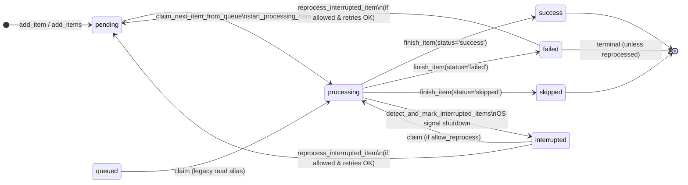
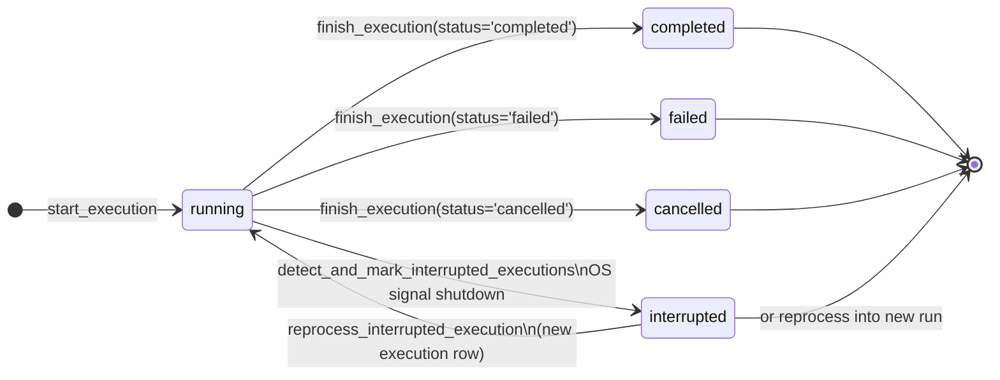
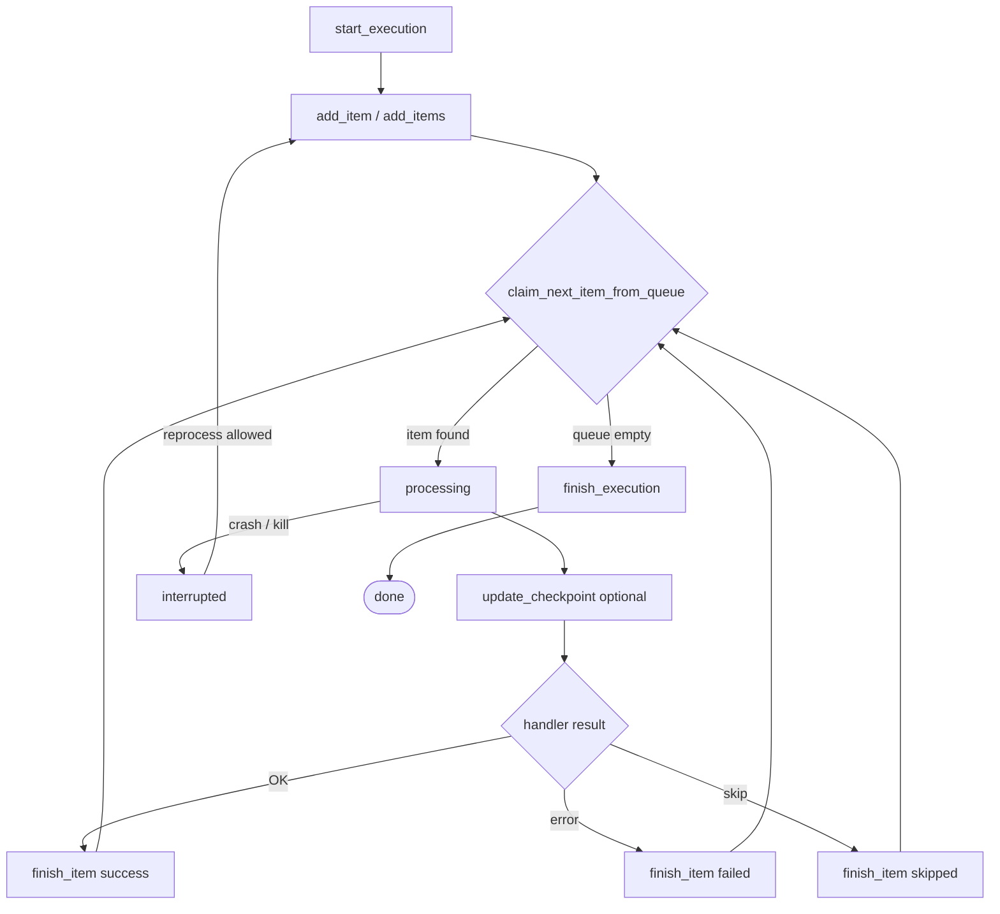

# RPA Suite — Wiki (v1.9.1)

Module documentation for the library. The recommended public API is `from rpa_suite import rpa`.

## Table of contents

1. [Print](#print)
2. [Date](#date)
3. [Clock](#clock)
4. [Directory](#directory)
5. [Email](#email)
6. [File](#file)
7. [Log](#log)
8. [Regex](#regex)
9. [Validate](#validate)
10. [Asyn](#asyn)
11. [Parallel](#parallel)
12. [Retry](#retry)
13. [Notifier](#notifier)
14. [Browser](#browser)
15. [Artemis](#artemis)
16. [Iris](#iris)
17. [CLI](#cli)
18. [Database](#database)

Optional install extras (in addition to `pip install rpa-suite`):

```bash
pip install rpa-suite[browser]      # Selenium
pip install rpa-suite[opencv]       # Artemis confidence (cv2)
pip install rpa-suite[ocr]          # Iris / docling
pip install rpa-suite[dashboard]    # Flask
pip install rpa-suite[postgres]
pip install rpa-suite[mysql]
pip install rpa-suite[sqlserver]
pip install rpa-suite[all]
```

---

# Print

**Print** is a submodule of the suite.
It has a different characteristic from the others.

It is implemented both on the root object and in its dedicated module. You can access its methods through the ``rpa`` variable as well as through the **Print** class.

Below are all methods and parameters available on **Print**:

Methods:

- ``success_print``
- ``alert_print``
- ``error_print``
- ``info_print``
- ``magenta_print``
- ``blue_print``
- ``print_call_fn``
- ``print_retur_fn``

Parameters:

- ``string_text``: ``str``
- ``color`` : ``Obj Colors``
- ``ending`` : ``str``

> To import the class on its own: `from rpa_suite.core import Print`

<br>

Example of the ``Print`` functions:

```python
# Import the instantiated suite
from rpa_suite import rpa

"""
Available colors
  black   
  blue  
  green   
  cyan  
  red   
  magenta 
  yellow  
  white   
  default 
  call_fn (blue variant) 
  retur_fn (magenta variant)
"""

# As explained earlier, all Print object functions are already implemented directly on the main module

rpa.success_print(f'It`s green here')
rpa.alert_print(f'It`s yellow message')
rpa.error_print(f'It`s red message')
rpa.info_print(f'It`s blue message')

rpa.magenta_print(f'What color? Magenta')
rpa.blue_print(f'Other blue')

# variants (these only exist to provide distinct colors for callers who want to be more direct and use fewer colors)
rpa.print_call_fn(f'foo')
rpa.print_retur_fn(f'foo2')
```

Below are usage variants and how to change the colors as you like:

> You can change the print color as you like; import the colors object to do so.
>
> You can also set "ending", just like Python's built-in print.

<br>

Example manipulating colors and ending:

```python
# Import the Suite object and Colors
from rpa_suite import rpa
from rpa_suite.core.print import Colors

# Passing arguments, changing behavior and colors
rpa.success_print(f'It`s red now!', color=Colors.red)
rpa.alert_print(f"This don't breakline on ending", ending=' ')
rpa.error_print(f'This message display on same line to alert.')

# Example with all arguments explicit
rpa.info_print(string_text=f'All arguments explicts',
               color=Colors.blue,
               ending="\n\n"
              )
```

<br>

# Date

**Date** is a simple object whose purpose is to speed up date and time conversion.
In many cases we need to capture dates — which is already easy — but we want to skip the tedious formatting.

Its main feature is returning a tuple already formatted as **strings** with **Day**, **Month**, and **Year**, using 2 digits for day and month and 4 digits for year. The same applies to **Hours**, **Minutes**, and **Seconds** (the latter also with 2 digits).

Below are all methods and parameters available on **Date**:

Methods:

- ``get_dmy``
- ``get_hms``
- ``stamp``
- ``today_br``
- ``shift_days``

Parameters:

- ``stamp(with_time=True)``
- ``shift_days(days)`` — negative for the past

Returns:

- ``get_dmy``  -> ``Tuple(str)``: ``'dd', 'mm', 'YYYY'``
- ``get_hms``  -> ``Tuple(str)``: ``'hour', 'min', 'sec'``
- ``stamp`` -> ``str``: timestamp for file names (``dd_mm_YYYY-HH_MM_SS``)
- ``today_br`` -> ``str``: current date as ``dd/mm/YYYY``
- ``shift_days(n)`` -> ``Tuple(str)``: day/month/year shifted by ``n`` days (negative = past)
- Note: Only "Year" uses 4 digits; all other values are always 2-digit **strings**.

> To import the class on its own: `from rpa_suite.core import Date`

<br>

Example of the ``Date`` methods:

```python
# Import the instantiated suite with all features
from rpa_suite import rpa

# Using the date variable (already instantiated Date object), we call the method that captures the current day, month, and year from the system.
dd, mm, yyyy = rpa.date.get_dmy()

# Using the date variable (already instantiated Date object), we call the method that captures the current hour, minutes, and seconds from the system.
hour, minute, sec = rpa.date.get_hms()

# Timestamp for file names and date in BR format
stamp = rpa.date.stamp()
today = rpa.date.today_br()
dd, mm, yyyy = rpa.date.shift_days(-1)

# displaying the date return value
rpa.info_print(f'date: {dd}/{mm}/{yyyy}')

# displaying the time return value
rpa.info_print(f'hour: {hour}:{minute}:{sec}')

>>> date: 18/04/2025
>>> hour: 04:44:29
```

<br>

# Clock

**Clock** is an object dedicated to execution control.
Sometimes you need a code block or an entire function to wait, run, and wait again — or even to use it as a schedule for an entire bot.

Below are all methods and parameters available on **Clock**:

Method ``exec_at_hour``:

- Timed function: runs the function at the specified time. By ``default`` it runs at call time; optionally you can choose the time as a ``string`` of hours and minutes with two digits, as shown: ``'hh:mm'``.
- Parameters:

  - ``hour_to_exec`` : ``str`` - Time in `'hh:mm'` format.
  - ``fn_to_exec``: ``Callable`` - Function you want to run.
  - ``*args``: Positional arguments for the function.
  - ``**kwargs``: Keyword arguments for the function.

<br>

Method ``wait_until_hour``:

- Blocks execution until the system clock reaches ``HH:MM`` (24h). It does not run a callback — use ``exec_at_hour`` for that.
- Parameters:

  - ``hour_to_wait`` : ``str`` - Time in `'hh:mm'` format.
  - ``poll_seconds`` : ``int`` - Interval between checks (default ``30``, the same as ``exec_at_hour``).

<br>

Method ``wait_for_exec``:

- Timed function: waits a number of **seconds**, then runs the function.
By ``default`` it runs at call time.
- Parameters:

  - ``wait_time`` : ``int`` - Time in seconds to wait.
  - ``fn_to_exec`` : ``Callable`` - Function you want to run.
  - ``*args``: Positional arguments for your function.
  - ``**kwargs``: Keyword arguments for your function.

<br>

Method ``exec_and_wait``:

- Timed function: runs the function from the argument and then waits the desired number of seconds. By ``default`` it runs at call time.
- Parameters:

  - ``wait_time``:``int`` - Time in seconds to wait after execution.
  - ``fn_to_exec``: ``Callable`` - Function you want to run.
  - ``*args``: Positional arguments for your function.
  - ``**kwargs``: Keyword arguments for your function.

<br>

> To import the class on its own: `from rpa_suite.core import Clock`

<br>

Example of ``exec_at_hour``:

```python
# Import the instantiated suite with all features
from rpa_suite import rpa


# The function you want to run
def sum(a, b):
  # perform whatever operations you need ...
  print(a*b)
  return a * b


# This step is not required; it only makes the example easier to read
a = 3
b = 9

# Run the function at the defined time
rpa.clock.exec_at_hour('12:52', sum, a, b)

# result: The sum function should run at 12:52 on the system clock where this code is running.
>>> 27
>>> sum: Successfully executed!
```

<br>

Example of ``wait_for_exec``:

```python
# Import the instantiated suite with all features
from rpa_suite import rpa


# The function you want to run
def sum(a, b):
  # perform whatever operations you need ...
  print(a*b)
  return a * b


# This step is not required; it only makes the example easier to read
a = 3
b = 9

# Run the function after 10 seconds
rpa.clock.wait_for_exec(10, sum, a, b)

# result: The sum function should run after the defined time.
>>> 27
>>> Function: wait_for_exec executed the function: sum.
```

<br>

Example of ``exec_and_wait``:

```python
# Import the instantiated suite with all features
from rpa_suite import rpa


# The function you want to run
def sum(a, b):
  # perform whatever operations you need ...
  print(a*b)
  return a * b


# This step is not required; it only makes the example easier to read
a = 3
b = 9
time_await = 10

# Run the function, then wait 10 seconds before continuing with the next code
rpa.clock.exec_and_wait(time_await, sum, a, b)

# The function below will only run 10 seconds after the function above
rpa.success_print(f'Run after: {time_await}')

# result: The sum function should run after the defined time.
>>> 27
>>> Function: wait_for_exec executed the function: sum.
>>> Run after: 10
```

<br>


# Directory

**Directory** is an object dedicated to directory handling: creating directories, deleting directories, and deleting contents inside directories.

Below are all methods and parameters available on **Directory**:

Method ``create_temp_dir``:

- Function responsible for creating a temporary directory. You can also create a directory with a custom name and save the relative path for later use. By ``default`` the directory name is "temp" and the path is where the function is being executed.
- Parameters:

  - ``path_to_create``: ``str`` - Path where the directory should be created.
  - ``name_temp_dir``: ``str`` - Desired name for the directory.
  - ``display_message``: ``bool`` - Whether to print messages to the terminal.
  - ``exist_ok``: ``bool`` - If ``True`` (default), reuses the directory when it already exists. Pass ``False`` to fail if it already exists.

<br>

Method ``delete_temp_dir``:

- Function responsible for deleting a temporary directory. You can also delete a directory with a custom name and optionally delete directories that still contain files. By ``default`` the directory name is "temp" and the path is where the function is being executed.
- Parameters:

  - ``path_to_delete``: ``str`` - Path of the directory to delete.
  - ``name_temp_dir``: ``str`` - Name of the directory to delete.
  - ``delete_files``: ``bool`` - Whether to delete the directory even if it is not empty.
  - ``display_message``: ``bool`` - Whether to print messages to the terminal.

<br>

Method ``ensure_dir``:

- Ensures the path exists (creates parents if needed). Safe to call if the directory already exists.
- Parameters:

  - ``path``: ``str`` - Path to ensure.
  - ``display_message``: ``bool`` - Whether to print messages to the terminal.

<br>

Method ``clear_dir``:

- Empties a directory (files and subdirectories) without deleting the directory itself.
- Parameters:

  - ``path``: ``str`` - Directory to empty.
  - ``display_message``: ``bool`` - Whether to print messages to the terminal.

<br>

Method ``temp_dir``:

- Context manager: creates the temp directory, yields the path, and on exit deletes the directory (including its contents).
- Parameters:

  - ``path_to_create``: ``str`` - Base path (default ``'default'`` = cwd).
  - ``name_temp_dir``: ``str`` - Directory name (default ``'temp'``).
  - ``delete_on_exit``: ``bool`` - If ``True`` (default), deletes when leaving the ``with`` block.
  - ``exist_ok``: ``bool`` - Reuses the directory if it already exists (default ``True``).
  - ``display_message``: ``bool`` - Whether to print messages to the terminal.

Example:

```python
from rpa_suite import rpa

with rpa.directory.temp_dir() as path:
    rpa.file.download("https://example.com/file.pdf", path)
```

<br>

> To import the class on its own: `from rpa_suite.core import Directory`

<br>

Example of ``create_temp_dir``:

```python
# Import the instantiated suite with all features
from rpa_suite import rpa

# Accessing the 'dir' directory instance, we call its method to create a temporary directory
result = rpa.directory.create_temp_dir()

# Displaying the result dict returned by the function
# The function returns a dict with the success status and the path of the created directory
rpa.success_print(result)

>>> The function should create a directory named 'temp' in the directory where this code is running.
>>> result: {'success': True, 'path_created': 'C:\\User\\path\\to\\your_project\\temp'}


# Using arguments
result_example2 = rpa.directory.create_temp_dir(path_to_create=r'.\docs', name_temp_dir='mydir')

# Displaying the result dict returned by the function
# The function returns a dict with the success status and the path of the created directory
rpa.success_print(result_example2)

>>> The function should create a directory named 'docs' and, inside it, another named 'mydir', using the current root as the starting point.
>>> result_example2: {'success': True, 'path_created': '.\\docs\\mydir'}
```

<br>

Example of ``delete_temp_dir``:

```python
# Import the instantiated suite with all features
from rpa_suite import rpa

# Accessing the 'dir' directory instance, we call its method to delete a temporary directory
result = rpa.directory.delete_temp_dir()

# Displaying the result dict returned by the function
# The function returns a dict with the success status and the path of the deleted directory
rpa.success_print(result)

>>> The function should delete a directory named 'temp' in the directory where this code is running.
>>> result: {'success': True, 'path_deleted': 'C:\\Intel\\PERSONAL\\_rpa_suite\\test_suite\\temp'}

# Using arguments
result_example2 = rpa.directory.delete_temp_dir(
    path_to_delete=r'.\docs', 
    name_temp_dir='mydir',
    delete_files=True)

# Displaying the result dict returned by the function
# The function returns a dict with the success status and the path of the deleted directory
rpa.success_print(result_example2)

>>> The function should delete a directory named 'mydir' inside the 'docs' directory, using the current root as the starting point.
>>> result_example2: {'success': True, 'path_deleted': '.\\docs\\mydir'}
```

# Email

**Email** is an object dedicated to emails — sending and handling. Only SMTP is implemented at this time; *additional methods will be available soon*.

Below are all methods and parameters available on **Email**:

Method ``send_smtp``:

- Function responsible for sending emails via SMTP, with optional attachments. The goal is to reduce the amount of boilerplate, since email requires many declared details.
By ``default`` the server, port, and authentication follow the Hostinger pattern, and the email body is already set to accept HTML content.

- Parameters:

  - ``email_user`` : ``str`` - Sender email.
  - ``email_password`` : ``str`` - Sender password.
  - ``email_to`` : ``str`` - Recipient email.
  - ``subject_title`` : ``str`` - Email subject.
  - ``body_message`` : ``str`` - Email message; **accepts HTML**.
  - ``attachments`` : ``list[str]`` - List of attachment paths.
  - ``smtp_server`` : ``str`` - Server to use.
  - ``smtp_port`` : ``int`` - Port to use.
  - ``auth_tls`` : ``bool`` - Authentication type; if **False, uses SSL**.
  - ``display_message``: ``bool`` - Whether to print messages to the terminal.

<br>

> To import the class on its own: `from rpa_suite.core import Email`

<br>

Example of ``send_smtp``:

```python
# Import the instantiated suite with all features
from rpa_suite import rpa

# Accessing the 'Email' instance, we call its method to send email via SMTP
rpa.email.send_smtp(email_user='your@email.com',
                    email_password='your_password',
                    email_to='destiny@email.com',
                    subject_title='Test Title',
                    body_message='Test body message.',
                    attachments=['C:/Users/rpa_suite/Pictures/logo_rpa_suite.jpg'],
                    smtp_server='smtp.gmail.com',
                    smtp_port=587,
                    auth_tls=False,
                    display_message=True)

```
<br>


## File

**File** is an object dedicated to basic file operations such as counting, creating, and deleting. It is aimed at more specific tasks to speed up development and simplify simple jobs.

Below are all methods and parameters available on **File**:

Method ``flag_create``:

- Function responsible for creating a file that serves as a flag to indicate that a script, automation, or application is running.
  By ``default`` the file name is ``running.flag``, but it can be changed via argument. The directory where it is created is the root where the code is running, and that can also be changed via parameters.
- Parameters:

  - ``name_file`` : ``str`` - Desired file name, including the extension.
  - ``path_to_create`` : ``str`` - Directory path where the file should be created.
  - ``display_message``: ``bool`` - Whether to print messages to the terminal.

<br>

Method ``flag_delete``:

- Function responsible for deleting a file that serves as a flag to indicate that a script, automation, or application is running.
  By ``default`` the file name is ``running.flag``, but it can be changed via argument. The directory where it will be deleted is the root where the code is running, and that can also be changed via parameters.
- Parameters:

  - ``name_file`` : ``str`` - Desired file name, including the extension.
  - ``path_to_delete`` : ``str`` - Directory path where the file should be deleted.
  - ``display_message``: ``bool`` - Whether to print messages to the terminal.

<br>

Method ``count_files``:

- Function responsible for counting files in a directory. You can specify the directory to count and the desired extension. Its main characteristic is that it already walks nested directories if they exist.
  By ``default`` the search path is the root where the code is running ``'.'``, using a relative path, and it searches for all extensions. The count is returned in a ``dict``.
- Parameters:

  - ``dir_to_count`` : ``str`` - Path to the directory you want to count
  - ``type_extension`` : ``str`` - Extension to count.
  - ``display_message``: ``bool`` - Whether to print messages to the terminal.

<br>

Method ``screen_shot``:

- Function responsible for capturing an image of the monitor in use. You can pass several arguments to parameterize it as you prefer. Its main characteristic is that it automatically creates both the directory and the file if no argument is passed, naming each image with date and time so you can capture multiple images if needed.
  By ``default`` the directory is created at the root where the code is running, the directory name is ``screenshots``, and the file name is ``'screenshot_dd_mm_YYYY-hh-mm-ss.png'``.
- Parameters:

  - ``file_name`` : ``str`` - File name, ``default`` being ``'screenshot'``.
  - ``path_dir`` : ``str`` - Path where the directory should be created.
  - ``save_with_date`` : ``bool`` - Whether to include the date in the file name, ``default`` being ``'True'``.
  - ``delay`` : ``int`` - Delay before generating the image, ``default`` being ``1``.
  - ``use_default_path_and_name`` : ``bool`` - Whether to use the default name and path; ``True`` by default.
  - ``name_ss_dir`` : ``str`` - Desired directory name if you do not want to keep the default.
  - ``display_message``: ``bool`` - Whether to print messages to the terminal.

<br>

Method ``copy`` / ``move``:

- Copies or moves a file/directory. If ``dst`` is an existing directory, the item is placed inside it.
- Parameters: ``src``, ``dst``, ``overwrite`` (default ``True``), ``verbose``.

Method ``zip_path`` / ``unzip_path``:

- Compresses a file or directory into ``.zip`` and extracts a zip file. The default unzip destination is the directory of the zip itself.

Method ``download``:

- Downloads an HTTP URL with ``requests`` and saves it to disk. If ``dest`` is omitted or is a directory, the name comes from the URL.

<br>

> To import the class on its own: `from rpa_suite.core import File`

<br>

Example of ``flag_create``:

```python
# Import the instantiated suite with all features
from rpa_suite import rpa

# Accessing the 'File' instance, we call its method to create a flag file in the directory where this file is running
rpa.file.flag_create(name_file='running_my_bot.flag',
                    display_message=True)


>>> Flag file created.
```

Example of ``flag_delete``:

```python
# Import the instantiated suite with all features
from rpa_suite import rpa

# Accessing the 'File' instance, we call its method to delete a flag file in the directory where this file is running
rpa.file.flag_delete(name_file='running_my_bot.flag',
                    display_message=True)


>>> Flag file deleted.
```

Example of ``count_files``:

```python
# Import the instantiated suite with all features
from rpa_suite import rpa

# Assume there is a 'docs' directory at the same level as this file, with 3 files inside it

# Accessing the 'File' instance, we call its method to count files; the relative path is passed as a list if you want to count multiple directories
result = rpa.file.count_files(['docs'], display_message=True)
rpa.success_print(result)


>>> Function: count_files counted 3 files.
>>> {'success': True, 'qt': 3}
```

Example of ``screen_shot``:

```python
# Import the instantiated suite with all features
from rpa_suite import rpa

# !Important: This feature requires the pyautogui and pillow libraries! (rpa_suite already installs them, but check if you run into problems)

# Accessing the 'File' instance, we call its method to take screenshots in a single line.
rpa.file.screen_shot()

>>> Directory:'C:\Users\You\your_project\here\screenshots' was created successfully.
```


<br>

## Log

**Log** is an object dedicated to creating, recording, and following logs. Its structure is quite simple and has only 2 kinds of method: the first configures the logger, creating a directory and a file for recording.

The second kind generates the desired logs.

Main highlights:
  - Easy to do everything with just 2 lines of code, and when the record already exists it is not replaced, which makes maintenance and continuity easier if you want to use it as a history.
  - Includes a method considered "start" that writes a blank line to the file, making it easier to split the file by executions.
  - Records data that make it easier to navigate large codebases by pointing to the last subdirectory and the file where the log was triggered.

Below are all methods and parameters available on **Log**:

Method ``config_logger``:

- Function that configures a logger and points it to the desired file path, writing logs to the file and also printing messages to the console. All messages are already customized so they can be distinguished. It also includes a word filter to exclude sensitive data if needed. (In this module we are constantly making adjustments to offer a more complete experience)
  By ``default`` the directory and file are created at the root where the code is running ``'.'``, using a relative path. That same path is used by the log functions to record messages in the file and also on the console.

> **⚠️ Important:**
> Make sure ``config_logger`` is executed before calling the log methods to avoid errors.

- Parameters:

  - ``path_dir`` : ``str`` - Path where the directory should be created; by ``default`` the path of the running file.
  - ``name_log_dir`` : ``str`` - Log directory name; by ``default`` it is ``'Logs'``.
  - ``name_file_log`` : ``str`` - Log file name; by ``default`` it is ``'log'`` with a fixed extension: ``.log``
  - ``filter_words`` : ``list[str]`` - List of words you want to filter out of the record; use this for sensitive data.

<br>

Methods ``log_start_run_debug``, ``log_debug``, ``log_info``, ``log_warning``, ``log_error``, ``log_critical``:

- Methods responsible for generating a log record in the file and on the console. In particular, the first method ``log_start_run_debug`` adds an empty line before recording the content, making it easier to split the file and find execution start points. All methods are pre-customized by their levels and also with colors so they can be distinguished from each other.

> **⚠️ Important:**
> Make sure ``config_logger`` is executed before calling the log methods to avoid errors.

- Parameters:

  - ``msg`` : ``str`` - Desired message in the log record.

<br>

> To import the class on its own: `from rpa_suite.core import Log`

<br>

Example of ``config_logger``:

```python
# Import the instantiated suite with all features
from rpa_suite import rpa

# Accessing the 'Log' instance, we call its method that configures the logger and also creates the directory and the log file
rpa.log.config_logger()

# This method should create a directory named Logs in the current execution location, with a 'log.log' file, so you can use the log functions to record in that file.

# !IMPORTANT: make sure you first instantiate config_logger in your code so you can freely use the log functions at any stage of your project and in any file. If the log methods are called without configuration first, they will raise an error.

>>> Directory:'C:\Users\You\your_project\here\Logs' was created successfully.
```


<br>

Example of ``log_start_run_debug``, ``log_info``, ``log_warning``, ``log_error`` ,``log_critical``, ``log_debug``:

```python
# Import the instantiated suite with all features
from rpa_suite import rpa


# !IMPORTANT: Make sure the config_logger method of this module has already been executed earlier in your project so it can capture and point to the correct file and generate the logs.


# Available log methods; they record both in the file and on the console, already customized, and also create space in the file to mark the start of execution with the start log
rpa.log.log_start_run_debug(f'Starting script execution {__file__}')

rpa.log.log_info(f'Running example task 1')

rpa.log.log_warning(f'Running example task 2 with warning')

rpa.log.log_error(f'Running example task 3 with error')

rpa.log.log_critical(f'Running example task 4 with critical error')

rpa.log.log_debug(f'Running example task 5 with debug')

>>> 21.04.25.00:33 DEBUG    Starting script execution c:\You\your_project\here\this_file.py
>>> 21.04.25.00:33 INFO     Running example task 1
>>> 21.04.25.00:33 WARNING  Running example task 2 with warning
>>> 21.04.25.00:33 ERROR    Running example task 3 with error
>>> 21.04.25.00:33 CRITICAL Running example task 4 with critical error
>>> 21.04.25.00:33 DEBUG    Running example task 5 with debug
```

<br>

## Regex

**Regex** is an object dedicated to regex usage. We provide a conventional method to search for a substring in a string. Later we will add features to make this module more interesting and usable in more cases.

Main highlights:
  - Easier to search for a string inside another string, faster than the conventional use of re.
  - Broader than Python's default ``__contains__`` because it already returns a boolean and lets you change the search with case sensitive set to False.

Below are all methods and parameters available on **Regex**:

Method ``check_pattern_in_text``:

- Function responsible for searching for a string inside another string, with optional case sensitivity, without ``if`` blocks and without needing to Upper or Lower the original content.


- Parameters:

  - ``origin_text`` : ``str`` - Text content for the search; must be a string.
  - ``pattern_to_search`` : ``str`` - Desired pattern to search for.
  - ``case_sensitive`` : ``bool`` - Whether the search should be case sensitive.
  - ``display_message``: ``bool`` - Whether to print messages to the terminal.


<br>

> To import the class on its own: `from rpa_suite.core import Regex`


<br>

Example of ``check_pattern_in_text``:

```python
# Import the instantiated suite with all features
from rpa_suite import rpa

# Accessing the 'Regex' instance, we call its method that searches for patterns in a text, with optional case sensitivity and message display, returning a boolean
result: bool = rpa.regex.check_pattern_in_text(origin_text= 'This is a simple text with a pattern to search: Hello, World!',
                                pattern_to_search= 'hello, world',
                                case_sensitive= False,
                                display_message= True)

if result:
    rpa.success_print('found!')


>>> Pattern found successfully!
>>> found!
```

<br>

## Validate

**Validate** is an object dedicated to data validation, including words, strings, and emails.

Main highlights:
  - The word method looks for words but already validates spaces and can split an entire text into a list of words to avoid false positives.
  - The emails method can validate lists of emails, which makes it easier to filter only valid emails for sending with a single call, returning a complete dictionary with all information such as counts and separate lists of valid and invalid emails.

Below are all methods and parameters available on **Validate**:

Method ``word``:

- Function responsible for searching for a string or word in a string, with optional case sensitivity and the ability to change the search mode with _search_by_.

  By ``default`` the search type is ``'string'``, and it can be changed to ``'word'``.

- Parameters:

  - ``origin_text`` : ``str`` - Text content for the search; must be a string.
  - ``searched_word`` : ``str`` - Desired pattern to search for.
  - ``case_sensitivy`` : ``bool`` - Whether the search should be case sensitive.
  - ``search_by`` : ``str`` - Search mode; can be ``string`` or ``word``. A _word_ search splits the original string so only valid occurrences are found.
  - ``display_message``: ``bool`` - Whether to print messages to the terminal.


<br>

> To import the class on its own: `from rpa_suite.core import Validate`


<br>

Example of ``word``:

```python
# Import the instantiated suite with all features
from rpa_suite import rpa

# Accessing the 'Validate' instance, we call its method that searches strings with a focus on words. We will implement a return with the number of occurrences and the start and end positions of each occurrence.
result: dict = rpa.validate.word(origin_text='Texto de origem', searched_word='Origem', case_sensitivy=True, search_by='string', display_message=True)

rpa.success_print(result)

>>> Function: word found no occurrences of "Origem" during the search.
>>> {'is_found': False, 'number_occurrences': 0, 'positions': []}
```

<br>

Method ``emails``:

- Function responsible for validating emails, which must be passed as a list of strings. Its implementation uses the __mail_validator__ library.

- Parameters:

  - ``email_list`` : ``list[str]`` - List of emails you want to validate.
  - ``display_message``: ``bool`` - Whether to print messages to the terminal.

- Returns:
  - ``dict``: Dictionary with the results.
      - ``success``: ``bool`` - Key that is true only if **all** emails are valid.
      - ``valid_emails``: ``list[str]`` - List of emails that are valid.
      - ``invalid_emails``: ``lis[str]`` - List of emails that are not valid.
      - ``qt_valids``: ``int`` - Number of valid emails.
      - ``qt_invalids``: ``int`` - Number of invalid emails.
      - ``map_validation``: ``list[ Obj(ValidatedEmail) ]`` - List of the _mail_validator_ objects that were returned.

<br>

> To import the class on its own: `from rpa_suite.core import Validate`


<br>

Example of ``emails``:

```python
# Import the instantiated suite with all features
from rpa_suite import rpa

# Accessing the 'Validate' instance, we call its 'emails' method, which validates a list checking whether the emails are valid. It uses the email_validator lib, which can be a bit slow.
result: dict = rpa.validate.emails(email_list=['email@teste.com', 'test@test.br', 'invnalid_email@test'], display_message=True)

rpa.success_print(result)

>>> Function: emails executed.
>>> {'success': False, 'valid_emails': ['email@teste.com'], 'invalid_emails': ['test@test.br', 'invnalid_email@test'], 'qt_valids': 1, 'qt_invalids': 2, 'map_validation': [<ValidatedEmail email@teste.com>]}
```

<br>

## Asyn

**Asyn**: A module designed to simplify running and managing **asynchronous** functions in automation scripts, using the **AsyncRunner** object.

Main characteristics:

- Simplified asynchronous calls, allowing cleaner and more direct code
- No need to manually create asynchronous functions just to call existing methods
- Efficient management of asynchronous tasks, speeding up script and automation development

<br>

Learn more about asynchronous programming at: *[Asynchronous Programming in Python](https://pythonacademy.com.br/blog/programacao-assincrona-no-python)*


> **⚠️ Important:**
> *Running functions asynchronously requires careful attention to avoid problems in the code. It is essential to understand the nuances among Concurrency, Parallelism, and Asynchronicity.*
> *Suggestions for deeper study:*
> *[&gt; Introduction to concurrency and parallelism](https://medium.com/nerd-for-tech/concurrency-and-parallelism-in-python-a-brief-introduction-9fd19b8c6433)*
> *[&gt; Learn about concurrency and parallelism in Python](https://medium.com/nerd-for-tech/concurrency-and-parallelism-in-python-a-brief-introduction-9fd19b8c6433)*

<br>

Below are all methods and parameters available on **Asyn**:

Method ``run``:

- Function responsible for starting execution of a function asynchronously.
- Parameters:

  - ``function`` : ``Callable[..., T]`` - The first argument must be your function or ``callable``.
  - ``*args``: ``Any`` - Positional arguments for your function or callable.
  - ``*kwargs``: ``Any`` - Keyword arguments for your function or callable.

Method ``is_running``:

- Function responsible for checking the function that is running asynchronously to see whether it has already finished.
- Parameters:

  - No arguments are passed by the user to this method.
  - ``return`` : ``bool`` - Returns ``False`` when the function executed asynchronously has already finished, ``True`` otherwise.

Method ``get_result``:

- Function responsible for retrieving the result (return value) of the function that was executed asynchronously. Note that get_result returns a dictionary inside another dictionary: the outer one with information about the asynchronicity that was created, and its result key with another dictionary containing the result (return value) of the function execution.
- Parameters:

  - ``timeout`` : ``Optional[float]`` - Optionally, a timeout can be passed to query and wait for the result.
  - ``return`` : ``Dict[str, Any]`` - Returns a dictionary containing asynchronicity information, and one of its keys returns a dictionary with the execution result.

Method ``cancel``:

- Function responsible for canceling the in-progress execution of the function that is running asynchronously. This method first validates whether it is really running before stopping it.
- Parameters:

  - No arguments are passed by the user to this method.

<br>

> To import the class on its own: `from rpa_suite.core import AsyncRunner`

<br>

Example of ``Asyn``:

```python
# Import the instantiated suite, and also the class to type our object and make method calls easier
from rpa_suite import rpa
from rpa_suite.core import AsyncRunner
from time import sleep


# Function that should run asynchronously, simulating a long-running task
def somar(a, b):
  
    print(f'Starting calculation function')
    sleep(4)
    print(f'finishing calculation function')
    return a + b


# Main function of your script or automation
def main():
  
    """Main automation flow"""
  

    print(f'Simulating some task')
    sleep(3)

    # Optionally you can instantiate the object from the class
    #runner: AsyncRunner = AsyncRunner()

    # Instantiating the asynchronous execution object
    runner: AsyncRunner = rpa.asyn()
  
    # Running the somar function asynchronously
    runner.run(somar, 10, 30)

    # Simulating another task while the somar function is still running
    print(f'running task 2 while somar is still running in parallel')
  
    # Wait 6 seconds to simulate another task. If this one is fast, it is important to always call the is_running() method to check whether the asynchronous function is still running.
    sleep(6)
  
    # We start the variable that will store the result of the somar function
    result_soma = None
  
    # We check whether the function is still running; if it is not, we call get_result() to obtain the result of the somar function.
    if not runner.is_running():
        respons = runner.get_result(30)
        if respons['success']:
            result_soma = respons['result']
  
    print(f'Result obtained: {result_soma}')  


if __name__ == '__main__':
    main()

```

<br>

## Parallel

**Parallel**: A module designed to simplify running and managing functions **in parallel** in automation scripts, using the **ParallelRunner** object.

Main characteristics:

- Simplified parallel execution, eliminating the complexity of manually managing processes
- Intuitive methods for creating, running, and monitoring parallel tasks
- Clean, direct code, reducing the typical verbosity of parallelism implementations
- Efficient abstraction of parallel execution mechanisms, making concurrent application development easier

<br>

Learn more about programming with parallelism at: *[Parallelism in Python (threads vs processes)](https://community.revelo.com.br/o-paralelismo-no-python-threads-vs-processos-parte-1/)*


> **⚠️ Important:**
> *Running functions asynchronously requires careful attention to avoid problems in the code. It is essential to understand the nuances among Concurrency, Parallelism, and Asynchronicity.*
> *Suggestions for deeper study:*
> *[&gt; Introduction to concurrency and parallelism](https://medium.com/nerd-for-tech/concurrency-and-parallelism-in-python-a-brief-introduction-9fd19b8c6433)*
> *[&gt; Learn about concurrency and parallelism in Python](https://medium.com/nerd-for-tech/concurrency-and-parallelism-in-python-a-brief-introduction-9fd19b8c6433)*

<br>

Below are all methods and parameters available on **ParallelRunner**:

Method ``run``:

- Function responsible for starting execution of a function **in Parallel**.
- Parameters:

  - ``function`` : ``Callable[..., T]`` - The first argument must be your function or ``callable``.
  - ``*args``: ``Any`` - Positional arguments for your function or callable.
  - ``*kwargs``: ``Any`` - Keyword arguments for your function or callable.

Method ``is_running``:

- Function responsible for checking the function that is running in parallel to see whether it has already finished.
- Parameters:

  - No arguments are passed by the user to this method.
  - ``return`` : ``bool`` - Returns ``False`` when the function executed in parallel has already finished, ``True`` otherwise.

Method ``get_result``:

- Function responsible for retrieving the result (return value) of the function that was executed in parallel. Note that get_result returns a dictionary inside another dictionary: the outer one with information about the parallelism that was created, and its result key with another dictionary containing the result (return value) of the function execution.
- Parameters:

  - ``timeout`` : ``Optional[float]`` - Optionally, a timeout can be passed to query and wait for the result.
  - ``return`` : ``Dict[str, Any]`` - Returns a dictionary containing parallelism information, and one of its keys returns a dictionary with the execution result.

Method ``cancel``:

- Function responsible for canceling the in-progress execution of the function that is running in parallel. This method first validates whether it is really running before stopping it.
- Parameters:

  - No arguments are passed by the user to this method.

<br>

> To import the class on its own: `from rpa_suite.core import ParallelRunner`

<br>

Example of ``Parallel``:

```python
# Import the instantiated suite, and also the class to show that it can be done in two different ways
from rpa_suite import rpa
from rpa_suite.core import ParallelRunner
import time

# Function that should run asynchronously, simulating a long-running task
def somar(a, b):
  
    print(f'Starting sum function')
    time.sleep(4)
    print(f'finishing sum function')
    return a + b


# Main function of your script or automation
def main():
  
    """Main automation flow"""
  
    print(f'running task 1')
    time.sleep(3)
  
    # Optionally you can instantiate the object from the class
    #runner: ParallelRunner = ParallelRunner()

    # Instantiating the runner for parallel execution from the suite object
    runner: ParallelRunner = rpa.parallel()
  
    # Call to the main 'run' function, which will dispatch your function in parallel
    runner.run(somar, 10, 30)

    # just an example to emulate a sequential task
    print(f'running task 2 while somar is still running in parallel')
  
    # Wait 6 seconds to simulate another task. If this one is fast, it is important to always call the is_running() method to check whether the parallel function is still running.
    time.sleep(6)
  
    # We start the variable that will store the result of the somar function
    result_soma = None

    # We check whether the function is still running; if it is not, we call get_result() to obtain the result of the somar function.
    if not runner.is_running():
        respons = runner.get_result(30)
        if respons['success']:
            result_soma = respons['result']
  

    print(f'Result obtained: {result_soma}')  


if __name__ == '__main__':
    main()

```

<br>

# Retry

**Retry** is a decorator that repeats a function on failure, with exponential backoff. Exposed on `rpa.retry` and also as `from rpa_suite.core import retry, RetryError`.

Parameters of ``retry``:

- ``attempts`` : ``int`` - Total number of attempts (>= 1). Default: ``3``.
- ``delay`` : ``float`` - Wait in seconds before the first retry. Default: ``0.5``.
- ``backoff`` : ``float`` - Multiplier of the delay between attempts. Default: ``2.0``.
- ``exceptions`` : type or iterable of exceptions that trigger retry. Default: ``Exception``.
- ``max_delay`` : ``float | None`` - Cap on the interval between attempts.
- ``jitter`` : ``float`` - Random jitter in seconds (``0`` disables it).
- ``on_retry`` : optional callback ``fn(attempt_index, exception, sleep_seconds)``.

If all attempts fail, ``RetryError`` is raised (the last exception is in ``__cause__`` and in ``last_exception``).

```python
from rpa_suite import rpa

@rpa.retry(attempts=4, delay=0.2, backoff=2.0, exceptions=TimeoutError)
def download_file():
    ...

try:
    download_file()
except rpa.RetryError as exc:
    rpa.error_print(str(exc))
```

> To import the class on its own: `from rpa_suite.core import retry, RetryError`

<br>

# Notifier

**Notifier** sends HTTP webhooks (JSON) to Slack, Microsoft Teams, and Telegram. It is already instantiated on ``rpa.notifier``. It uses ``requests`` (a core dependency).

Methods:

- ``send_webhook(url, payload, method='POST', headers=None, timeout=None)``
- ``slack(webhook_url, text, blocks=None, timeout=None)``
- ``teams(webhook_url, title, text, theme_color='0076D7', timeout=None)``
- ``telegram(bot_token, chat_id, text, parse_mode=None, disable_web_page_preview=True, timeout=None)``

Returns: ``dict`` with ``status_code``, ``ok``, and ``body``.

```python
from rpa_suite import rpa

rpa.notifier.slack("https://hooks.slack.com/services/...", "Bot finished with 42 items")
rpa.notifier.teams("https://outlook.office.com/webhook/...", "RPA", "Run completed")
rpa.notifier.telegram(bot_token="123:ABC", chat_id="@channel", text="Bot ok")
```

> To import the class on its own: `from rpa_suite.core import Notifier, NotifierError`

<br>

# Browser

**Browser** automates Chrome via Selenium + debugging port. It is an optional extra: ``pip install rpa-suite[browser]``. Then use ``rpa.browser`` (the class; instantiate with ``rpa.browser()``).

> The current implementation targets Windows (`chrome.exe` via `cmd.exe`).

Public methods:

- ``start_browser(close_chrome_on_this_port=True, timeout=10, verbose=False)``
- ``configure_browser()``
- ``get(url, verbose=False)``
- ``find_ele(value, by=By.XPATH, timeout=12, verbose=True)``
- ``close_browser(verbose=False)``

```python
from rpa_suite import rpa
from selenium.webdriver.common.by import By

browser = rpa.browser(port=9393)
browser.start_browser(verbose=True)
browser.get("https://example.com")
el = browser.find_ele("//h1", by=By.XPATH)
browser.close_browser()
```

If ``rpa.browser`` is ``None``, the ``[browser]`` extra is not installed.

> To import the class on its own (requires selenium): `from rpa_suite.core import Browser`

<br>

# Artemis

**Artemis** does desktop automation by vision (PyAutoGUI): locate an image on the screen and click it. It is included in the basic install (`pyautogui`). The ``confidence`` parameter only works with OpenCV: ``pip install rpa-suite[opencv]``. Without the extra, the search uses exact pixel matching.

Use ``rpa.artemis`` (class): ``bot = rpa.artemis()``. Default images are in the ``resource`` directory.

Public methods:

- ``click_image(image_label, images_folder='resource', confidence=0.78, timeout=10.0, ...)``
- ``find_image_position(image_label, images_folder='resource', confidence=0.8, timeout=5.0, ...)``
- ``wait_and_click(image_label, images_folder='resource', confidence=0.8, timeout=30.0)``
- ``quick_click(image_label, images_folder='resource')``

Returns: ``(x, y)`` if found, or ``False``.

```python
from rpa_suite import rpa

desktop = rpa.artemis()
pos = desktop.click_image("save_button.png", timeout=8.0)
if not pos:
    rpa.alert_print("Image not found")

desktop.wait_and_click("ok_button", timeout=30.0)
desktop.quick_click("menu_icon")
```

> To import the class on its own: `from rpa_suite.core import Artemis`

<br>

# Iris

**Iris** converts documents (PDF, images, text) with OCR/AI via **docling**. Extra: ``pip install rpa-suite[ocr]``. Use ``rpa.iris`` (class).

Methods:

- ``read_document(file_path, result_format=ExportFormats.MARKDOWN, verbose=False)``
- ``read_documents(list_file_path, result_format=ExportFormats.MARKDOWN, verbose=False)``

Formats: ``MARKDOWN``, ``DICT``, ``DOCTAGS``, ``HTML``, ``TEXT``, ``INDENTEDTEXT``.

```python
from rpa_suite import rpa
from rpa_suite.core.iris import ExportFormats

iris = rpa.iris()
markdown = iris.read_document("invoice.pdf", ExportFormats.MARKDOWN)
batches = iris.read_documents(["a.pdf", "b.pdf"], ExportFormats.TEXT)
```

If ``rpa.iris`` is ``None``, the ``[ocr]`` extra is not installed.

> To import the class on its own (requires docling): `from rpa_suite.core.iris import Iris, ExportFormats`

<br>

# CLI

The library exposes a CLI via ``python -m rpa_suite``. The dashboard requires ``pip install rpa-suite[dashboard]``.

```bash
python -m rpa_suite version
python -m rpa_suite db-stats path/to/file.db
python -m rpa_suite db-stats path/to/file.db --json
python -m rpa_suite dashboard path/to/file.db --port 5001
python -m rpa_suite dashboard path/to/file.db --host 127.0.0.1 --port 5001 --debug
```

The ``dashboard`` command opens the HTML UI (executions, items, logs) against a SQLite file generated by the Database module.

<br>

# Database

**Database** is the RPA Suite module for execution tracking, item queues, structured logs, retention, reprocessing, and observability. It is designed for production RPA workflows: idempotent queues, checkpoints, retries, interruption handling, deduplication, and a built-in HTML dashboard.

You can import it in several ways:

```python
from rpa_suite.core import Database, DatabaseType, RetentionPolicy
from rpa_suite import rpa

db = rpa.database(...)          # via Suite
db = Database(...)              # direct import (recommended)
```

> **Optional dependency:** the HTML dashboard requires Flask (`pip install rpa-suite[dashboard]`).

---

## Table of contents

1. [Concepts](#concepts)
2. [Supported backends](#supported-backends)
3. [Constructor](#constructor)
4. [Quick start](#quick-start)
5. [Executions](#executions)
6. [Items & queue](#items--queue)
7. [Logs](#logs)
8. [Reprocessing](#reprocessing)
9. [Interruptions](#interruptions)
10. [Retention & storage](#retention--storage)
11. [Cleanup](#cleanup)
12. [Statistics & dashboard queries](#statistics--dashboard-queries)
13. [HTML dashboard](#html-dashboard)
14. [CLI](#cli)
15. [Best practices](#best-practices)

---

## Concepts

The module organizes RPA work into three layers:

| Layer | Purpose |
|-------|---------|
| **Executions** | One bot run (start → finish). Holds counters, metadata, and status. |
| **Items** | Individual work units inside a queue (orders, files, records, etc.). |
| **Logs** | Structured messages tied to an execution (and optionally forwarded to `Log`). |

### Item status model

The library **writes** these statuses:

```
pending → processing → success | failed | skipped | interrupted
```

- `queued` and `retrying` are **read aliases** for legacy rows; new inserts use `pending`.
- **`execution_id`** on an item = the execution that **created** it (`create_execution` in the dashboard).
- **`last_execution_id`** = the last execution that **touched** the item (claim, checkpoint, finish, reprocess, etc.).

#### Item status flow diagram



| Transition | Typical API |
|------------|-------------|
| → `pending` | `add_item`, `add_items`, `reprocess_interrupted_item` |
| → `processing` | `claim_next_item_from_queue`, `start_processing_item` |
| → `success` / `failed` / `skipped` | `finish_item` |
| → `interrupted` | `detect_and_mark_interrupted_items`, signal handler on shutdown |
| `interrupted` / `failed` → `pending` | `reprocess_interrupted_item`, `reprocess_items_from_execution` |

> **`retrying`** is not written by current code; treat it as a legacy read alias grouped with backlog filters.

#### Execution status flow diagram



| Transition | Typical API |
|------------|-------------|
| → `running` | `start_execution` |
| → `completed` / `failed` / `cancelled` | `finish_execution` |
| → `interrupted` | `detect_and_mark_interrupted_executions`, signal handler |
| `interrupted` → new `running` | `reprocess_interrupted_execution` (creates a child execution) |

#### End-to-end flow (execution + items)



### Active execution

After `start_execution()`, the instance stores `_current_execution_id`. Many methods accept an optional `execution_id`; when omitted, they use the active execution.

Always call `start_execution()` before adding items/logs, or pass `execution_id` explicitly.

---

## Supported backends

```python
from rpa_suite.core import DatabaseType

DatabaseType.SQLITE       # default — local file, best for dev/single-bot
DatabaseType.POSTGRESQL   # production server
DatabaseType.MYSQL        # production server
DatabaseType.SQLSERVER    # production server (requires pyodbc + ODBC driver)
```

### SQLite (default)

```python
db = Database(
    db_path="my_bot.db",
    db_dir="database",           # folder for the file; "default" = cwd
    executions_table="exec_bot",
    items_table="items_bot",
    logs_table="logs_bot",
)
```

### PostgreSQL / MySQL

```python
db = Database(
    db_type=DatabaseType.POSTGRESQL,
    host="localhost",
    port=5432,
    database="rpa_db",
    user="rpa_user",
    password="secret",
    use_pool=True,
    pool_size=5,
)
```

### SQL Server

```python
db = Database(
    db_type=DatabaseType.SQLSERVER,
    host="localhost",
    port=1433,
    database="rpa_db",
    user="sa",
    password="secret",
    driver="ODBC Driver 17 for SQL Server",  # optional
    trust_server_certificate=True,
    encrypt=True,
)
```

Requires: `pip install rpa-suite[sqlserver]` and a system ODBC driver.

---

## Constructor

```python
Database(
    db_type=DatabaseType.SQLITE,
    db_path="athena_executions.db",
    db_dir="default",
    host=None,
    port=None,
    database=None,
    user=None,
    password=None,
    driver=None,
    trust_server_certificate=True,
    encrypt=True,
    use_pool=True,
    pool_size=5,
    executions_table="athena_executions",
    items_table="athena_items",
    logs_table="athena_logs",
    allow_reprocess_interrupted_items=False,
    allow_reprocess_interrupted_executions=False,
    auto_detect_interruptions=True,
    mark_stale_on_init=False,
    auto_generate_execution_id=True,
    prevent_duplicate_items=False,
    unique_item_field="item_identifier",
    duplicate_item_behavior="skip",
    log_instance=None,
    verbose=False,
    retention_policy=None,
)
```

| Parameter | Type | Description |
|-----------|------|-------------|
| `db_type` | `DatabaseType` | Backend. Default: `SQLITE`. |
| `db_path` | `str` | SQLite file name (combined with `db_dir`). |
| `db_dir` | `str` | Directory for SQLite file. `"default"` = current working directory. Created if missing. |
| `host`, `port`, `database`, `user`, `password` | — | Server backends (PostgreSQL, MySQL, SQL Server). |
| `driver` | `str` | SQL Server ODBC driver name. |
| `trust_server_certificate`, `encrypt` | `bool` | SQL Server connection options. |
| `use_pool`, `pool_size` | — | Connection pooling (PostgreSQL/MySQL). |
| `executions_table`, `items_table`, `logs_table` | `str` | Custom table names (validated). |
| `allow_reprocess_interrupted_items` | `bool` | Allow reprocessing interrupted/failed items. |
| `allow_reprocess_interrupted_executions` | `bool` | Allow cloning an interrupted execution into a new run. |
| `auto_detect_interruptions` | `bool` | Register OS signal handlers to mark running work as interrupted on shutdown. |
| `mark_stale_on_init` | `bool` | On init, mark stale `running`/`processing` rows as interrupted. |
| `auto_generate_execution_id` | `bool` | Generate UUID for external `execution_id` when not provided. |
| `prevent_duplicate_items` | `bool` | Global deduplication across the items table. |
| `unique_item_field` | `str` | `"item_identifier"` or `"item_data.<key>"` (e.g. `"item_data.order_id"`). |
| `duplicate_item_behavior` | `str` | `"skip"` (return existing id) or `"error"`. |
| `log_instance` | `Log` | Optional `rpa_suite.core.Log` — DB logs also go to the file logger. |
| `verbose` | `bool` | Print init messages. |
| `retention_policy` | `RetentionPolicy` \| `dict` \| `None` | Automatic TTL/row-cap cleanup (see [Retention](#retention--storage)). |

### Context manager

```python
with Database(db_path="bot.db", auto_detect_interruptions=False) as db:
    exec_id = db.start_execution(automation_name="my-bot")
    ...
# connection closed automatically
```

---

## Quick start

Full minimal flow: execution → batch items → process → logs → finish → dashboard.

```python
from rpa_suite.core import Database

db = Database(
    db_path="rpa_test.db",
    db_dir="database",
    executions_table="execution_rpa_test",
    items_table="items_rpa_test",
    logs_table="logs_rpa_test",
    allow_reprocess_interrupted_items=True,
    prevent_duplicate_items=True,
    unique_item_field="item_data.amount",
    auto_detect_interruptions=False,
)

exec_id = db.start_execution(
    automation_name="order_processor",
    metadata={"version": "1.0.0", "env": "prod"},
)

db.add_log_info("Bot started", step_name="Init")

item_ids = db.add_items(
    items=[
        {
            "item_identifier": "ORD-001",
            "item_data": {"order_id": "ORD-001", "amount": 150.0},
            "priority": 10,
            "max_retries": 3,
        },
        {
            "item_identifier": "ORD-002",
            "item_data": {"order_id": "ORD-002", "amount": 80.0},
            "priority": 5,
        },
    ]
)

def handle_item(item: dict) -> str:
    # your business logic here
    return "Processed OK"

stats = db.process_queue(exec_id, handler=handle_item)
db.add_log_success(f"Queue done: {stats}", step_name="Finish")
db.finish_execution(exec_id)
db.close()
```

---

## Executions

### Methods

| Method | Description |
|--------|-------------|
| `start_execution(...)` | Start a new run; sets active execution. Returns internal `id` (int). |
| `finish_execution(execution_id, status='completed', error_message=None)` | Close a run. Status: `completed`, `failed`, `cancelled`. |
| `get_execution(execution_id)` | Fetch one execution row as dict. |
| `get_executions(status=None, automation_name=None, limit=None)` | List executions with optional filters. |
| `detect_and_mark_interrupted_executions(scope='current')` | Mark unfinished runs as `interrupted`. |
| `check_interrupted()` | Deprecated; returns whether current execution was interrupted. |

### `start_execution`

```python
exec_id = db.start_execution(
    automation_name="invoice_bot",
    execution_id="optional-external-uuid",   # optional; auto-generated if omitted
    metadata={"client": "ACME", "batch": 42},
)
```

**Returns:** `int` — internal primary key (`id`). Use this for items, logs, and finish calls.

### `finish_execution`

```python
db.finish_execution(exec_id, status="completed")
db.finish_execution(exec_id, status="failed", error_message="SMTP timeout")
```

Updates counters (`total_items`, `successful_items`, `failed_items`, `interrupted_items`) from items linked to that execution.

---

## Items & queue

### Adding items

#### `add_item`

```python
item_id = db.add_item(
    execution_id=None,              # uses active execution if omitted
    item_identifier="PED-1001",
    item_data={"order_id": "PED-1001", "value": 250.0},
    processing_schema={"steps": ["validate", "submit"]},
    priority=10,                    # higher = claimed first
    max_retries=3,                  # 0 = unlimited
)
```

**Returns:** `int` — item id. With dedup enabled, may return an existing id (`duplicate_item_behavior="skip"`).

#### `add_items` (batch)

```python
ids = db.add_items(
    execution_id=exec_id,
    items=[
        {"item_identifier": "A", "item_data": {"id": "A"}, "priority": 1},
        {"item_identifier": "B", "item_data": {"id": "B"}, "priority": 2},
    ],
    default_priority=0,
    default_max_retries=0,
)
```

**Returns:** `list[int]` — created item ids.

### Deduplication

When `prevent_duplicate_items=True`:

```python
db = Database(
    prevent_duplicate_items=True,
    unique_item_field="item_identifier",       # or "item_data.order_id"
    duplicate_item_behavior="skip",            # or "error"
)
```

- **`skip`:** second insert with the same unique value returns the existing item id.
- **`error`:** raises `DatabaseError`.

### Processing items (manual)

Recommended pattern: **claim atomically**, then finish.

```python
item = db.claim_next_item_from_queue(exec_id)
if item:
    try:
        db.update_checkpoint(item["id"], "Downloading file")
        result = process(item["item_data"])
        db.update_checkpoint(item["id"], "Upload complete")
        db.finish_item(item["id"], status="success", notes=str(result))
    except Exception as exc:
        db.finish_item(item["id"], status="failed", error_message=str(exc))
```

| Method | Description |
|--------|-------------|
| `claim_next_item_from_queue(execution_id, include_interrupted=None)` | Atomically claim next item (`pending`/`queued`/`interrupted`). **Prefer this** over manual get+start. |
| `get_next_item_from_queue(execution_id, include_interrupted=None)` | Read-only peek; does not change status. |
| `start_processing_item(item_id)` | Mark item as `processing` (non-atomic alternative). |
| `update_checkpoint(item_id, checkpoint)` | Save last checkpoint string; updates `last_execution_id`. |
| `finish_item(item_id, status='success', error_message=None, notes=None)` | Finalize item. Status: `success`, `failed`, `skipped`. |
| `get_item(item_id)` | Fetch one item; normalizes JSON fields. |
| `get_item_by_unique_key(unique_value)` | Lookup by dedup field when enabled. |

### `process_queue` (high-level loop)

Runs the claim → handler → finish loop for you:

```python
def my_handler(item: dict) -> str:
    return f"Done {item['item_identifier']}"

stats = db.process_queue(
    execution_id=exec_id,
    handler=my_handler,
    max_items=None,              # limit items this call
    stop_on_error=False,         # stop loop on first exception
    include_interrupted=None,    # None = use Database default
    on_success=None,             # optional callback(item, result)
    on_error=None,               # optional callback(item, exception)
)
# stats: {"processed": 10, "success": 9, "failed": 1}
```

### Listing items — `get_items`

```python
# Pending items in the current execution (default)
pending = db.get_items()

# All unfinished work across every execution
backlog = db.get_items(scope="all", status="backlog")

# Failed items in a specific execution
failed = db.get_items(execution_id=exec_id, status="failed")
```

| Parameter | Description |
|-----------|-------------|
| `execution_id` | Filter by execution. Overrides `scope` when set. |
| `status` | Filter group or exact status (default: `pending`). |
| `scope` | `"current"` (default) or `"all"`. |

**Status groups:**

| Value | Includes |
|-------|----------|
| `pending` | `pending`, `queued` |
| `executed` | `success`, `failed`, `skipped` |
| `interrupted` | `interrupted` |
| `backlog` / `reprocessavel` | unfinished work (pending, queued, interrupted, retrying, failed, processing) |
| `all` | no status filter |

> Do not pass `backlog` as `scope`. Use `get_items(scope="all", status="backlog")`.

---

## Logs

### Log levels (class constants)

`LOG_LEVEL_DEBUG`, `LOG_LEVEL_INFO`, `LOG_LEVEL_WARNING`, `LOG_LEVEL_ERROR`, `LOG_LEVEL_CRITICAL`, `LOG_LEVEL_SUCCESS`

### Methods

| Method | Description |
|--------|-------------|
| `add_log(message, execution_id=None, log_level=INFO, step_name=None)` | Generic log insert. |
| `add_log_debug`, `add_log_info`, `add_log_warning`, `add_log_warn`, `add_log_error`, `add_log_critical`, `add_log_success` | Shortcuts for each level. |
| `get_logs(execution_id=None, log_level=None, step_name=None, limit=None, order_desc=True)` | Query logs. |
| `clear_logs(execution_id=None, log_level=None, older_than_days=None, confirm=False)` | Delete logs (`confirm=True` required). |

### Examples

```python
db.add_log_info("Reading input file", step_name="Step 1 - Extract")
db.add_log_warning("Retry attempt 2", step_name="Step 2 - Submit")
db.add_log_error("Validation failed", step_name="Step 2 - Submit")
db.add_log_success("Batch completed", step_name="Step 3 - Finish")

entries = db.get_logs(execution_id=exec_id, order_desc=False)
for entry in entries:
    print(entry["log_level"], entry["step_name"], entry["message"])
```

When `log_instance` is set on `Database`, each DB log is also forwarded to the file `Log` object.

---

## Reprocessing

Enable flags at construction:

```python
db = Database(
    allow_reprocess_interrupted_items=True,
    allow_reprocess_interrupted_executions=True,
)
```

| Method | Description |
|--------|-------------|
| `can_reprocess_item(item_id)` | Check if item is eligible. |
| `reprocess_interrupted_item(item_id)` | Reset item to `pending`, bump `retry_count`. |
| `reprocess_items_from_execution(execution_id, statuses=None)` | Reprocess multiple items from one execution. |
| `can_reprocess_execution(execution_id)` | Check if execution can be cloned. |
| `reprocess_interrupted_execution(execution_id)` | Create new execution with copies of unfinished items. Returns new `exec_id`. |
| `is_reprocessable(item_row)` | Low-level eligibility check on a row dict. |

```python
new_exec_id = db.reprocess_interrupted_execution(old_exec_id)
db.process_queue(new_exec_id, handler=my_handler)
```

---

## Interruptions

On process kill (Ctrl+C, task kill, etc.), when `auto_detect_interruptions=True`:

1. Current execution → `interrupted`
2. Items in `processing` → `interrupted`

Manual detection:

```python
marked_exec_ids = db.detect_and_mark_interrupted_executions(scope="all")
marked_item_ids = db.detect_and_mark_interrupted_items(scope="current")
```

Use `mark_stale_on_init=True` to clean up leftover `running`/`processing` rows from a previous crash when the bot starts again.

---

## Retention & storage

Automatic cleanup by age and row caps.

```python
from rpa_suite.core import Database, RetentionPolicy

db = Database(
    db_path="bot.db",
    retention_policy={
        "enabled": True,
        "auto_on_init": False,
        "auto_on_finish_execution": True,
        "logs": {
            "max_age_days": 30,
            "max_age_days_by_level": {"error": 90, "critical": 180},
            "max_rows": 1_000_000,
        },
        "items": {
            "max_age_days_by_status": {"success": 60, "failed": 120},
            "max_rows_by_status": {"success": 500_000},
        },
        "executions": {
            "max_age_days_by_status": {"completed": 90, "failed": 120},
        },
    },
)

# Manual run
summary = db.apply_retention_policy(dry_run=True)   # preview counts
summary = db.apply_retention_policy(dry_run=False)  # delete

stats = db.get_storage_stats()  # row counts + SQLite file size
```

Protected statuses (not deleted by default): pending, processing, interrupted, running, etc.

---

## Cleanup

Destructive operations require `confirm=True`.

| Method | Description |
|--------|-------------|
| `clear_pending_items(confirm=True)` | Remove pending/queued items. |
| `clear_interrupted_items(confirm=True)` | Remove interrupted items. |
| `clear_successful_items(confirm=True)` | Remove successful items. |
| `clear_failed_items(confirm=True)` | Remove failed items. |
| `clear_interrupted_executions(confirm=True)` | Remove interrupted executions. |
| `clear_successful_executions(confirm=True)` | Remove completed executions. |
| `clear_failed_executions(confirm=True)` | Remove failed executions. |
| `clear_items_table(confirm=True)` | Wipe all items. |
| `clear_executions_table(confirm=True)` | Wipe all executions. |
| `clear_logs_table(confirm=True)` | Wipe all logs. |
| `clear_database(confirm=True)` | Wipe everything. |

---

## Statistics & dashboard queries

Programmatic queries used by the dashboard (also callable from your code):

| Method | Description |
|--------|-------------|
| `get_statistics(execution_id=None)` | Aggregated execution/item/log stats. |
| `list_executions(...)` | Paginated executions with filters. |
| `list_items(...)` | Paginated items; exposes `create_execution` / `last_execution`. |
| `list_logs(...)` | Paginated logs. |
| `dashboard_summary()` | Overview KPIs for the dashboard home page. |
| `executions_over_time(days=14)` | Daily execution counts for charts. |
| `item_status_distribution(execution_id=None)` | Item counts by status. |
| `log_level_distribution(execution_id=None)` | Log counts by level. |
| `top_automations(limit=5)` | Most frequent automation names. |

```python
summary = db.dashboard_summary()
print(summary["executions"]["total"], summary["items"]["pending"])
```

---

## HTML dashboard

Local Flask UI to inspect executions, items, and logs.

### Programmatic

```python
from rpa_suite.core import Database
from rpa_suite.core.dashboard import run_dashboard

db = Database(db_path="rpa_test.db", db_dir="database", ...)
run_dashboard(db, host="127.0.0.1", port=5001)
```

### CLI (SQLite file)

```bash
pip install rpa-suite[dashboard]
python -m rpa_suite dashboard database/rpa_test.db --port 5001
python -m rpa_suite dashboard database/rpa_test.db --host 127.0.0.1 --port 5001 --debug
```

### Pages

| URL | Content |
|-----|---------|
| `/` | Overview — KPIs, charts (executions over time, item status, log levels, top automations). |
| `/executions` | Paginated executions; filter by status, automation name, date range. |
| `/items` | Paginated items; filter by execution id, status, identifier search. Columns: **Create exec**, **Last exec**, expandable **Data** JSON preview. |
| `/logs` | Paginated logs; filter by execution id, level, message search. |

### JSON API (for charts / integrations)

| Endpoint | Description |
|----------|-------------|
| `GET /api/summary` | Same as `dashboard_summary()`. |
| `GET /api/executions/timeseries?days=14` | Executions per day. |
| `GET /api/items/status?execution_id=` | Item status distribution. |
| `GET /api/logs/levels?execution_id=` | Log level distribution. |
| `GET /api/executions/top?limit=5` | Top automations. |

---

## CLI

```bash
# Dashboard
python -m rpa_suite dashboard path/to/file.db --port 5001

# Storage stats (JSON or plain text)
python -m rpa_suite db-stats path/to/file.db
python -m rpa_suite db-stats path/to/file.db --json

# Version
python -m rpa_suite version
```

---

## Best practices

1. **Always** call `start_execution()` before adding items/logs (or pass `execution_id` every time).
2. **Prefer** `claim_next_item_from_queue()` over `get_next_item_from_queue()` + `start_processing_item()` — it is atomic under concurrency.
3. **Prefer** `process_queue()` when every item follows the same handler pattern.
4. Use **`update_checkpoint()`** at meaningful steps for observability and recovery.
5. Use **`scope="all"`** only when you intentionally want cross-execution backlog (e.g. shared SQLite queue across runs).
6. Enable **`prevent_duplicate_items`** when the same business key must not enter the queue twice.
7. Set **`auto_detect_interruptions=True`** in production; combine with `finish_execution()` in a `finally` block when possible.
8. Use **`dict`** for `item_data` — the library normalizes JSON on read; the dashboard shows a readable preview.
9. Call **`db.close()`** or use `with Database(...) as db:` when done; especially important with connection pools.
10. For long-running bots, configure **`retention_policy`** to avoid unbounded table growth.

### Recommended shutdown pattern

```python
exec_id = db.start_execution(automation_name="my-bot")
try:
    db.process_queue(exec_id, handler=my_handler)
    db.finish_execution(exec_id, status="completed")
except Exception as exc:
    db.finish_execution(exec_id, status="failed", error_message=str(exc))
    raise
finally:
    db.close()
```

---

## Related

- PyPI: `pip install rpa-suite`
- Extras: `[browser]`, `[opencv]`, `[ocr]`, `[dashboard]`, `[postgres]`, `[mysql]`, `[sqlserver]`, `[all]`
